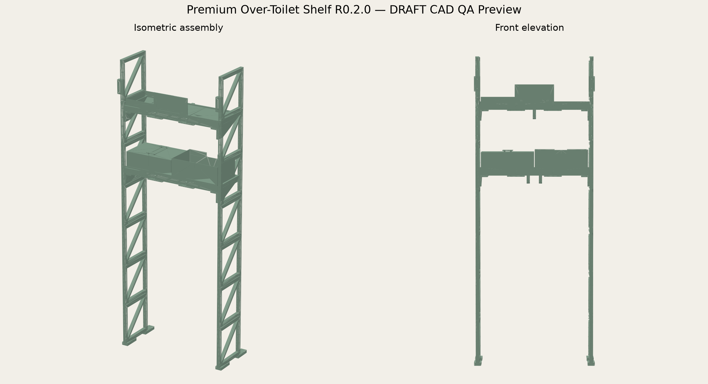

# Premium Parametric Over-Toilet Shelf — Revision 0.2.0 DRAFT

Parametrisches, bodenstehendes FDM-Regal für den Raum über einem WC. Die Primärlast läuft über vier Bodenfüße; zwei zwingende hintere Wandhalter sichern gegen Kippen. Der Spülkasten ist nur ein gemessener Freiraum und trägt keine Last.



## Freigegebene Default-Anforderungen

| Merkmal | Wert |
|---|---:|
| Gesamtmaß ab hinterer Rahmenebene | 680 × 300 × 1650 mm |
| Installierte Tiefe inkl. 20-mm-Wandabstand | 320 mm |
| Freie Shelf-Breite / Shelf-Tiefe | 620 / 240 mm |
| Toilet-Freiraum | 560 mm breit, 950 mm hoch |
| Shelf-Oberseiten ab Boden | 1050 und 1400 mm |
| Shelf-Aufteilung | 3 Tiles je Ebene |
| Seitenrahmen | 7 Segmente je Seite |
| Aufstand / Wandrestriktion | 4 Füße / 2 höhenverstellbare Abstandshalter |
| Zieldruckraum | 256 × 256 × 300 mm |

## Kernmerkmale

- Zwei offene, diagonal ausgesteifte Seitenrahmen mit M4-verschraubten Segmentnähten.
- Zwei 32-mm-Shelves mit durchgehenden 14 × 32 mm Randträgern, Rippen und verschraubten Unterseitenverbindern.
- Sechs-Spalten-Modulraster für Drawer, Bin, Tray, Divider, Open und Hanger.
- Breite Drei-Spalten-Module werden für den Druck mittig geteilt und mit prüfpflichtigen M3-Nahtplatten montiert.
- Austauschbare Fascias und Header-Inserts mit Text, prozeduralem Finish oder optional lokalisierter 16-Bit-Bildgravur.
- Gekaufte Metallfastener und substratspezifische Wandanker; keine gedruckten Primärgewinde oder Wanddübel.

## Konfiguration

`design-spec.yaml` ist die alleinige Anforderungsquelle. `parameters.json` enthält den aktuellen R0.2.0-Default-Build:

- `installation`: Gesamtmaß, Toilet-Freiraum, Wall-Gap, Baseboard und freie Wandbreite.
- `frame`: Seitentiefe/-dicke, Segmentierung, 50-mm-Raster, vier Füße und Wandhalterachsen.
- `shelf`: 32-mm-Querschnitt, Tiles, Rippen und Nahtverbinder.
- `levels`: absolute Shelf-Oberseite ab Boden, Module und Hanger.
- `module_grid`: sechs Spalten, Drawer-Spiel und Split-Policy über 245 mm.
- `personalization`: austauschbare Fascias/Header und optionale Bildrelief-Einlage.

## DRAFT bauen und prüfen

```bash
python build.py --config parameters.json --output output/rev-0.2.0-draft --clean
python validate.py --output output/rev-0.2.0-draft
python render_preview.py
```

Der aktuelle DRAFT-Export enthält STEP und STL. Eine exakte, profilgebundene 3MF fehlt, weil in der Erzeugungsumgebung kein unterstützter Slicer verfügbar war.

## Nachweisstatus

- Requirements- und Konzeptfreigabe: PASS für Revision 0.2.0.
- Architekturplan: PASS.
- 42 eindeutige Druckdateien / 69 konfigurierte Instanzen einschließlich drei Coupon-Dateien; 63 benannte Assembly-Körper.
- Digitale Mesh-/Integrationsprüfung des aktuellen revisionsgebundenen DRAFT: PASS.
- Geometrie-Revision `r0.2.0-draft.2`: alle sechs M3-Modulnahtplatten liegen digital ohne Luftspalt auf ihren Bossoberseiten; reale M3-Hardware und Nahtprüfung bleiben offen.
- Exakte Slicer-/3MF-, Fit-, M3-Naht-, M4/M5-, Site-, Creep-, Proof-, Cycle-, Drawer- und Anti-Kipp-Nachweise: offen.
- 4 kg je Shelf ist nur ein Prüfziel, keine freigegebene Lastangabe.

Siehe `reports/final-model-result.md`, `reports/optimization-baseline.md`, `reports/mesh-complexity.md`, `reports/physical-test-plan.md` und `test-plan.yaml`.

## Sicherheit

Nicht als Sitz, Tritt, Griff, Kletterhilfe oder Kindersicherung verwenden. Nie ungesichert freistehend betreiben. Wandaufbau und Anker müssen vor Ort geprüft werden. Erste Last- und Anti-Kipp-Prüfungen außerhalb des Badezimmers, hinter einer Barriere und mit ungefährlichem Ballast durchführen.
