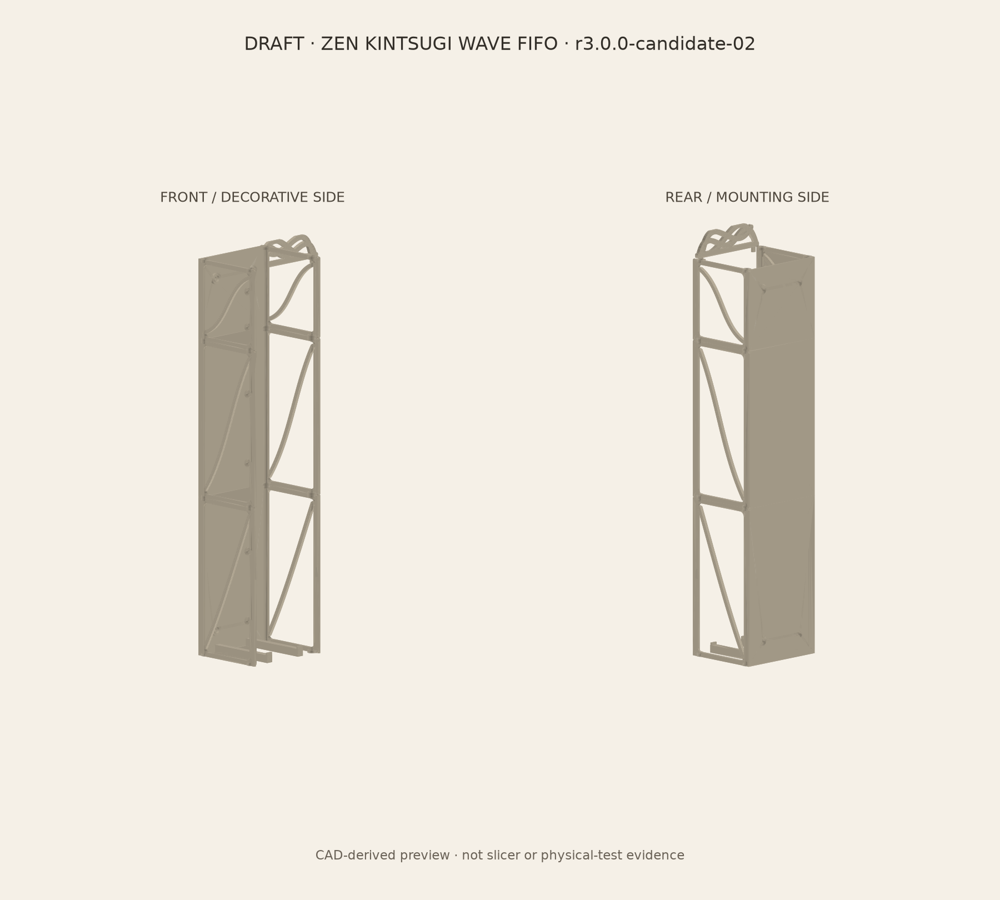

# DRAFT model result — ZEN KINTSUGI WAVE FIFO r3.0.0

Candidate `r3.0.0-candidate-02` continues the approved revision-3 concept as a fully parametric CadQuery production model without image-to-3D source geometry. The current DRAFT passes its deterministic V0 source and V1 digital-geometry suite; it is not slicer-validated, physically qualified, proof-tested, watermarked, or approved for final release.

## Model result

- Three serviceable structural PETG modules form a five-roll, top-load / lower-front-output gravity column. The base assembly is `150.0 x 123.9 x 635.4 mm`; the optional clipped wave crown reaches a maximum Z of `675.4 mm`.
- The approved rigid roll gauge is `122 mm` diameter x `107 mm` axial width, oriented front-to-back. Five nominal stored positions are defined from Z `65.932829 mm` at a `122 mm` pitch.
- Candidate-02 resolves candidate-01 collisions without changing the approved architecture: rear roll clearance increased from `3.0` to `5.0 mm`, leaving `0.4 mm` axial clearance to the retained 8 mm wall bosses; the output lift nose begins `0.3 mm` beyond the parked gauge front and is `2.7 mm` long.
- Removable procedural side skins, separate gold spline inlays, the optional crown, optional dry-scent-stone tray, module-joint coupons and skin/inlay coupons are all generated from deterministic parameters.
- The visible crown spline/ribbon field is clipped to its declared 40 mm height so buffering cannot silently exceed the production parameter.

## Verification and print readiness

- `PASS`: current requirements and concept approvals, geometry-revision consistency, parameter assertions, valid single-solid B-Reps, assembled seam non-intersection, base/crown envelope limits, local corrected clearances, and draft-export/manifest integrity.
- `PASS`: each of the five `122 x 107 mm` stationary rigid gauges has `0.0 mm3` positive-volume intersection with every assembled structural module.
- `PASS`: all 15 draft STLs are watertight, positive-volume and single-component. The largest mesh is 11,792 triangles / 589,684 bytes; the set totals 60,150 triangles / 3,008,760 bytes.
- Mesh decimation is recorded as `not-beneficial`; exact B-Rep/STEP remains authoritative and the draft STLs use direct 0.10 mm / 0.15 rad tessellation.
- The intended PETG, 0.6 mm nozzle and 0.30 mm structural layers remain provisional until the actual printer and exact slicer profile are confirmed. Bounds fit the legacy-reported 420 x 420 x 500 mm build volume, but this is not an exact-slicer result.

## Deliverables

- Specification and decisions: [`design-spec.yaml`](../design-spec.yaml), [`decision-log.md`](../decision-log.md)
- Parametric source: [`generate_r3.py`](../source/generate_r3.py), [`procedural_profiles.py`](../source/procedural_profiles.py)
- DRAFT assembly: [`3MF`](../exports/draft/3mf/DRAFT_ZEN_KINTSUGI_WAVE_FIFO_R3_assembly.3mf), [`STEP`](../exports/draft/step/DRAFT_ZEN_KINTSUGI_WAVE_FIFO_R3_assembly.step)
- Per-part and coupon exports: [`STL directory`](../exports/draft/stl), [`STEP directory`](../exports/draft/step)
- Evidence: [`digital-validation-r3.json`](../validation/digital-validation-r3.json), [`build-manifest-r3.json`](../validation/build-manifest-r3.json), [`DRAFT preview`](../validation/DRAFT_r3_candidate-02_preview.png)
- Reproduction tools: [`validate_r3.py`](../validation/validate_r3.py), [`render_r3_draft.py`](../validation/render_r3_draft.py)

## Open items and limitations

- Confirm actual maximum/adverse roll samples, printer/build volume, filament profile and exact slicer; inspect all layers and complete the optimization/slicer-resolution gate.
- Validate continuous descent/removal motion, paper snagging and double release, then run the required 100 full FIFO cycles. The five-position digital check is not a motion or reliability result.
- Print and measure the joint/alignment and skin/inlay/insert coupons before full-module printing.
- Select substrate-specific screws/anchors and obtain human approval for a guarded installed proof test; no wall-load rating is claimed.
- Complete physical cleaning, bathroom exposure and optional accessory retention checks.

## Kennzeichnung

- JuSt Innovation `JSI-WM-001-R1`: deliberately not inserted; watermark and final release gates remain blocked until production geometry, slicer evidence and physical verification are stable.

Next, confirm the target printer/slicer profile and print the joint plus skin/inlay coupons before committing to the three full structural modules.
