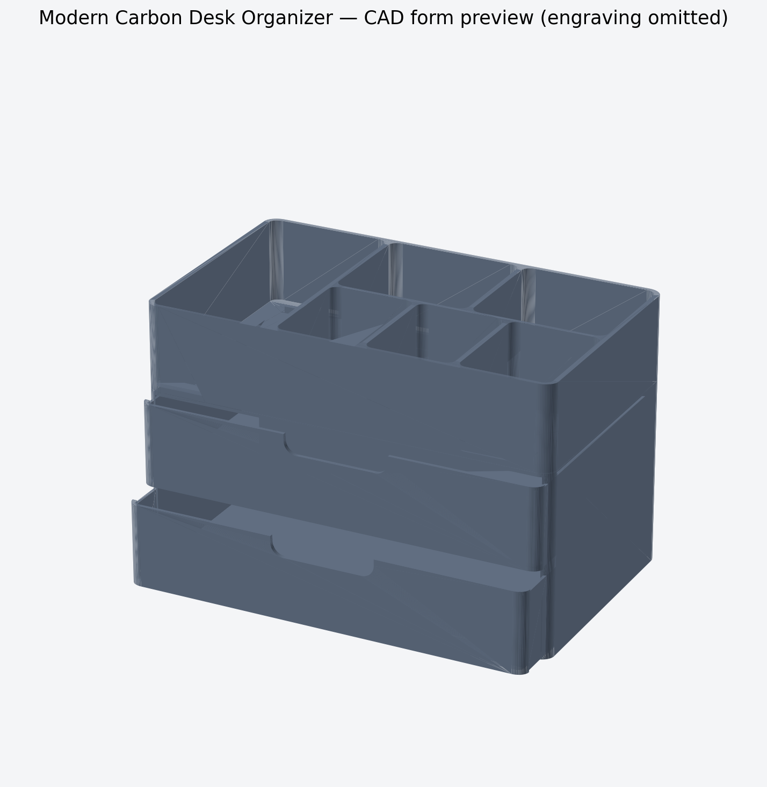

# Moderner Carbon Desk Organizer — Revision 1.1.2

Großer, parametrierbarer FDM-Organizer mit zwei identischen Schubladen, sechs offenen Sortierfächern und einer gemeinsamen Rundungsrichtung um die vertikale Achse. Die Schubladenfront ist keine separat gerundete Rechteckplatte: Sie folgt als 2,35-mm-Offset direkt der Grundrisskurve des Gehäuses.



Die technische Vorschau lässt die dichte Gravur absichtlich weg. Die freigegebene Oberflächenwirkung zeigt `assets/concept/desk_organizer_concept_r1.1.2.png`; die Fertigungs-STLs enthalten die vollständige bildbasierte Geometrie.

## Abmessungen

| Merkmal | Maß |
|---|---:|
| Außenmaß geschlossen montiert | 320 × 230 × 213,6 mm |
| Schubladengehäuse | 320 × 230 × 148,8 mm einschließlich Steckzapfen |
| Nominale Schubladenfront | 315,3 × 3,6 × 65,2 mm |
| Gefertigtes Front-Mesh nach Gravur | ca. 315,13 × 225,25 × 65,2 mm Gesamt-Schubladenmaß |
| Top-Sorter | 320 × 230 × 68 mm |
| Sortierfächer | 6 |
| Carbon-Kachel | 36 × 36 mm, nahtlos wiederholt |
| Gravurtiefe / Geometrieabstand | 0,32 / 0,30 mm |

Alle Fertigungsteile passen in den 420 × 420 × 500 mm großen Bauraum des Anycubic Kobra 3 Max. Das Gehäuse ist bereits auf der Rückseite liegend exportiert und belegt etwa 320 × 148,8 mm auf dem Druckbett; die Druckhöhe beträgt 230 mm.

## Carbon-Gravur

Die 1024²-Pixel große 16-Bit-Höhenkarte `assets/concept/carbon_twill_heightmap_16bit_v1.png` wird auf ein physisches 36-mm-Raster abgebildet und für die Fertigungsgeometrie mit 0,30 mm abgetastet. Weiß erzeugt die größte Vertiefung. Die Textur ist keine Renderfarbe und kein aufgesetztes Streifenmuster.

Texturiert werden:

- Gehäuse: linke Seite, rechte Seite und äußere Rückwand;
- Top-Sorter: alle vier äußeren vertikalen Wände als durchgehende Umfangsabbildung;
- Schubladen: beide gebogenen Frontflächen, einschließlich der Gehäusekurve;
- nicht texturiert: Griffe, Fachinnenseiten, Gleitflächen, Steckflächen und Sorter-Oberrand.

Das Relief ist rein kosmetisch. Es macht gewöhnliches PLA/PETG nicht zu einem Carbon-Verbundwerkstoff.

## Fertigungsdateien

- `output/stl/01_housing_print_on_back.stl` — Gehäuse, druckorientiert
- `output/stl/02_drawer_print_twice.stl` — identische Schublade, zweimal drucken
- `output/stl/03_top_sorter_print_bottom_down.stl` — Top-Sorter
- `output/stl/04_fit_coupon_optional.stl` — 0,30 / 0,45 / 0,60 mm Spiel je Seite
- `output/stl/05_carbon_texture_coupon_optional.stl` — senkrechte Heightmap-Gravurprobe
- `output/base/` — untexturierte Basiskörper vor dem Boolean
- `output/cutters/` — geschlossene, wasserdichte Heightmap-Cutter
- `output/assembly/desk_organizer_assembly_preview.stl` — leichte Formvorschau ohne Gravur
- `output/validation-report.json` — unabhängige Prüfung aller zwölf Export-Meshes

## Reproduzierbare Quellen

- `src/desk_organizer.mjs` — parametrische Form, Oberflächenabbildung und Booleans
- `model_parameters.json` — Benutzerparameter
- `relief-config.json` — Heightmap-Zeichen, Tiefe, Kachelmaß und Flächenzuordnung
- `tools/prepare_texture_data.py` — 16-Bit-Vorbereitung auf 120 × 120 periodische Samples
- `assets/carbon_twill_height_samples_u16.raw` und zugehörige JSON-Metadaten
- `design-spec.yaml` und `decision-log.md` — freigegebener Designvertrag und Entscheidungen

## Neu erzeugen

Voraussetzung: Node.js 20+, Python 3.10+, NumPy, SciPy und Pillow.

```bash
npm install
npm run build
npm run validate
npm run preview
```

`npm run build` erzeugt standardmäßig die 0,30-mm-Finalgeometrie. Für einen schnellen Geometriecheck:

```bash
QUALITY=draft npm run build
```

Danach immer erneut den Finalbuild und `npm run validate` ausführen. Die Final-STLs sind wegen der echten Heightmap-Geometrie groß; das ist beabsichtigt.

## Status und Grenzen

Alle fünf Fertigungs-STLs, vier Cutter und drei Basiskörper bestehen die V1-Prüfung auf Wasserdichtigkeit, Orientierung, positive Volumina und erwartete Körperzahl. Slicer-Toolpaths und physische Coupons wurden noch nicht geprüft; Revision 1.1.2 bleibt daher `experimental`. Die Schubladen sind vollständig herausnehmbar und besitzen keinen harten Auszugsstopp.
