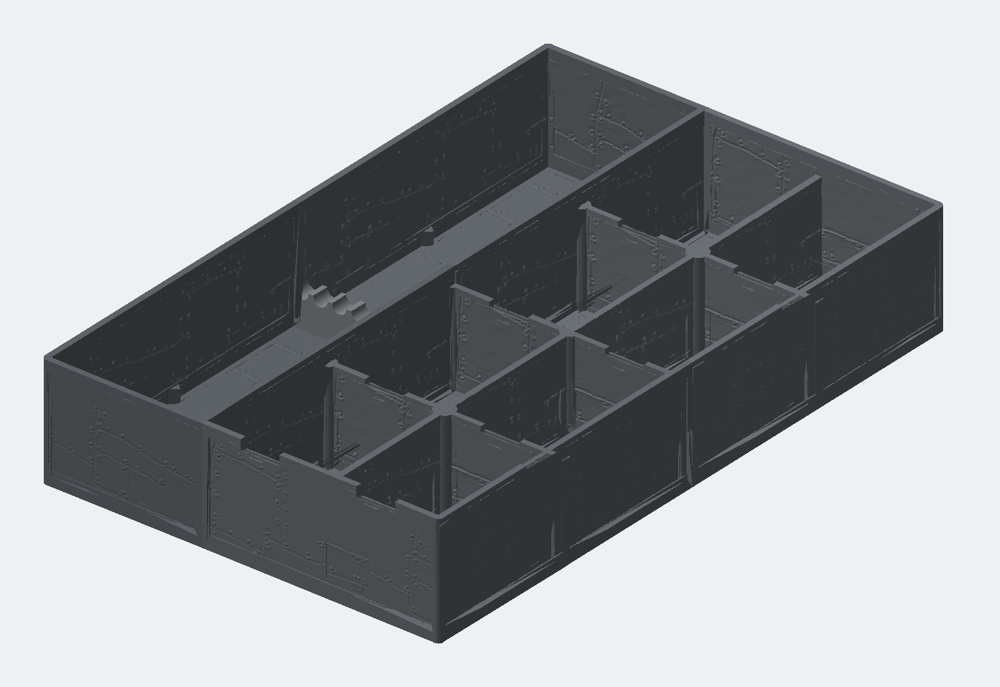

# Schubladen-Organizer R1.3 – aspekt-sicheres 16-Bit-Relief bei 0,30 mm (DRAFT)

Parametrische, vierteilige FDM-Einlage für eine Schublade mit 360 × 230 × 80 mm Innenmaß. Der Kandidat nutzt 227 × 357 × 64 mm und lässt nominell 1,5 mm Spiel an jeder XY-Seite.

> **Status:** Anforderungen und Konzept R1 sind freigegeben. R1.3 behält Geometrie, Reliefhöhe und speichereffiziente 0,30-mm-Abtastung bei und korrigiert die frühere anisotrope Bildskalierung. Ersatzbilder behalten jetzt ihr natürliches quadratisches-Pixel-Seitenverhältnis in physischen Millimetern. Alle neun STL-Netze sind digital geprüft. Die Dateien bleiben `DRAFT`, bis reale Slicer-/Couponprüfungen bestätigt wurden.



## Aufbau

- Vier steckbare Hauptmodule, jeweils höchstens 135 × 186,5 mm Druckfläche.
- Linke 92-mm-Zone für lange Schraubendreher; separater Kamm mit acht Schaftplätzen.
- Rechte 135-mm-Zone mit acht Hardwarefächern (2 Spalten × 4 Reihen) und jeweils einer 22 × 8-mm-U-Griffnut mit 4-mm-Bodenradius.
- 2,6-mm-Boden und 3,2-mm-Basiswandstärke mit optionalen Außen-/Trennwand-Overrides.
- Vollhohe Wandknoten: 4,0-mm-T-Blenden und 5,5-mm-Kreuzungshubs von 2,6 bis 55 mm.
- Supportfreie flache Druckorientierung; ebene Puzzleverbinder mit 0,30 mm Nennspiel.
- Innenböden sowie sichtbare Innen-/Außenwandbänder tragen die unregelmäßige R1-Stahlplatten-/Nietenstruktur.

## Oberflächenbild mit einem Befehl austauschen

Für ein neues PNG, JPEG oder TIFF genügt im Projektverzeichnis:

```bash
python3 rebuild.py /pfad/zur/neuen-textur.png
```

Der Befehl erledigt ohne weitere Parameter:

1. das Bild als wiederverwendbaren 16-Bit-Quellmaster registrieren;
2. das natürliche Quellseitenverhältnis physisch erhalten und vor Geometrie hart validieren;
3. die 16-Bit-Fertigungs-Heightmap, Quadratpixel-Vorschau und das kontinuierliche 0,30-mm-Geometriemanifest erzeugen;
4. einen 20-mm-Kreis-/Quadrat-Diagnosetest durch dieselbe Rasterpipeline führen;
5. alle Module speichereffizient bauen und numerische Float32-Mikrokanten reparieren;
6. 3MF und Revisions-ZIP erzeugen und alle neun STL-Dateien, Tonwertübertragung, Seitenverhältnis und 3MF prüfen.

Ein Build mit dem bereits registrierten Master lautet:

```bash
python3 rebuild.py
```

Nur Bild und Heightfield neu aufbereiten, ohne Geometrie:

```bash
python3 rebuild.py /pfad/zur/neuen-textur.png --prepare-only
```

Einmalige Python-Abhängigkeiten, falls sie noch fehlen:

```bash
python3 -m pip install -r requirements.txt
```

Fehlende gesperrte Node-Abhängigkeiten installiert `rebuild.py` beim ersten vollständigen Build automatisch mit `npm ci`.

## Parameter statt Kommandozeilen-Kette

- `relief/organizer/relief-job.json`: 180-mm-Kachelbreitenanker, aus dem Quellseitenverhältnis abgeleitete Kachelhöhe, 0,20-mm-Bildpitch, 127 PPI, Repeat-Fit, 7-mm-Nahtüberblendung, Gamma/Pegel, Polarität, 1,5-%-Validierungsschwelle und stabile Zielpfade.
- `config/relief-config.json`: 0,30-mm-Geometriepitch, Neutralwert/Höhenkurve und Speicherstrategie.
- `config/model-params.json`: 0,50-mm-Gravur, 0,55-mm-Emboss, Wand-/Bodenstärken, Flächenmasken und Organizermaße.

Nach einer reinen Geometrieänderung mit bereits vorbereitetem Relief:

```bash
npm run build
npm run validate
```

## Bild- und Geometrieauflösung

| Stufe | Physische Größe | Raster | Pitch | PPI | Tonwerte |
|---|---:|---:|---:|---:|---:|
| Registrierter Quellmaster | 180 × 120 mm | 1536 × 1024 | 0,1171875 mm effektiv | 216,75 effektiv, isotrop | 16-Bit-Container; Quelle besitzt 8-Bit-Ursprungspräzision |
| Fertigungs-Heightmap | 180 × 180 mm Zielbereich | 900 × 900 | 0,20 mm | 127 | enthält 1,0 × 1,5 Wiederholungen der unverzerrten Kachel |
| Physische Wiederholkachel | 180 × 120 mm | 900 × 600 | 0,20 mm | 127 | 46.214 unterschiedliche uint16-Werte nach Nahtüberblendung |
| Manifold-Heightfield | 180 × 120 mm | 601 × 401 | 0,30 mm | 84,67 | 39.402 unterschiedliche uint16-Werte |
| Exportierte Modulböden | objektabhängig | Float32-STL | – | – | 138.901–190.705 verschiedene Z-Werte |

Es gibt keine Schwellwerte, Tiefenklassen, Rasterläufe oder bewusste Höhenquantisierung. Dunkle Werte werden kontinuierlich bis 0,50 mm graviert, helle bis 0,55 mm erhaben. Auf Außenwänden bleibt das Relief in einem 0,35-mm-Rezess innerhalb der Einbauhülle.

Für einen neuen 3:2-AI-Master nennt `relief/organizer/source/source-spec.json` vor der Erzeugung 180 × 120 mm bei 300 PPI beziehungsweise mindestens 2126 × 1417 Pixel. Bei einem beliebigen späteren Ersatzbild bleibt die Breite 180 mm; die Höhe wird aus dessen natürlichem Quadratpixel-Seitenverhältnis abgeleitet. Tatsächliche Pixelzahl, physische Größe, effektive isotrope PPI, Bitpräzision, Quelle und Hash werden neu registriert.

`aspect_policy=preserve` und `allow_aspect_distortion=false` sind verbindlich. Ein `stretch`-Fit oder eine explizite Kachelgröße mit falschem Seitenverhältnis bricht vor dem teuren Geometrieaufbau ab. Für `steel1.png` lauten Quell-, platzierter und rekonstruierter physischer Aspekt jeweils exakt 1,5; der Metadatenfehler beträgt 0,000000 %. Der 20-mm-Diagnosetest ergibt bei der 0,30-mm-Geometrieabtastung 19,8 × 20,1 mm und bleibt innerhalb der 1,5-%-Texturtoleranz.

## Speicherstrategie und gemessener Bedarf

- Jedes Hauptmodul läuft in einem eigenen Node/WASM-Prozess.
- Innerhalb eines Moduls wird jeweils nur ein Boden- oder Wand-Reliefpatch gleichzeitig erzeugt und boolesch angewendet.
- STL wird blockweise geschrieben; die 3MF wird aus reparierten indexierten Mesh-Caches direkt in ZIP/XML gestreamt.
- Die Topologieprüfung läuft pro STL in einem frischen Python-Prozess.

| Prozess bei 0,30 mm | Gemessene Peak-RSS |
|---|---:|
| Driver vorn | 1.276,1 MiB |
| Driver hinten | 1.494,6 MiB |
| Hardware vorn | 2.084,0 MiB |
| Hardware hinten | 1.929,3 MiB |
| Zubehör | 216,1 MiB |

Der gemessene Worst Case beträgt exakt 2.083,953 MiB = 2,035 GiB = 2,185 GB dezimal. Für diesen Parametersatz sind 4 GB **verfügbarer** RAM eine vernünftige Untergrenze; ein System mit 8 GB Gesamt-RAM lässt deutlich mehr Reserve für Betriebssystem und Slicer.

## Drucken

1. Zuerst `DRAFT-drawer-fit-corner-coupon.stl`, beide Connector-Coupons und `DRAFT-relief-depth-coupon.stl` drucken.
2. Passung, Steckspiel und Reliefwirkung im realen Prozess prüfen.
3. `output/DRAFT/DRAFT-R1.3-aspect-safe-030mm-assembly.3mf` im Slicer öffnen oder die vier Modul-STLs einzeln laden.
4. Die Module flach mit der geschlossenen Unterseite auf dem Druckbett und ohne Supports drucken.
5. Den Schraubendreherkamm separat drucken und einsetzen.

Das PETG-Ausgangsprofil steht in `print-profile.md`. Temperaturen und Fluss müssen dem konkreten Filamentprofil folgen.

## Wichtige Dateien

- `rebuild.py` – einfacher Bildwechsel und vollständiger Rebuild
- `src/prepare_relief.py` – Quellregistrierung und 127-PPI-Fertigungs-Heightmap
- `src/validate_aspect_ratio.py` – harter physischer Seitenverhältnis-Gate vor Geometrie
- `src/validate_aspect_diagnostic.py` – 20-mm-Kreis-/Quadrat-Regressionsprüfung
- `src/vectorize_heightmap.py` – kontinuierliches 16-Bit-Geometriemanifest
- `src/manifold_model.mjs` – parametrische Produktionsgeometrie und sequenzielle Reliefpatches
- `src/manifold_build.mjs` – isolierter Modulbuild und blockweiser Export
- `src/build_pipeline.py` – sequenzielle Build-, Reparatur-, Paket- und Prüfsteuerung
- `src/package_3mf.py` – gestreamte 3MF aus reparierten indexierten Meshes
- `relief/organizer/relief-job.json` – persistenter Bild-/PPI-/Mappingvertrag
- `reports/build-pipeline.json` – Laufzeiten und gemessener RAM-Peak
- `reports/mesh-validation.json` – unabhängige Prüfung aller neun STLs
- `reports/continuous16-validation.json` – 16-Bit-, Höhen-, Struktur- und 3MF-Nachweis

Ein STEP-Export ist nicht enthalten, weil kein STEP-fähiges parametrisches CAD-Backend verfügbar war. Die JavaScript-/Manifold3D-Quelle ist der parametrierbare Master.
