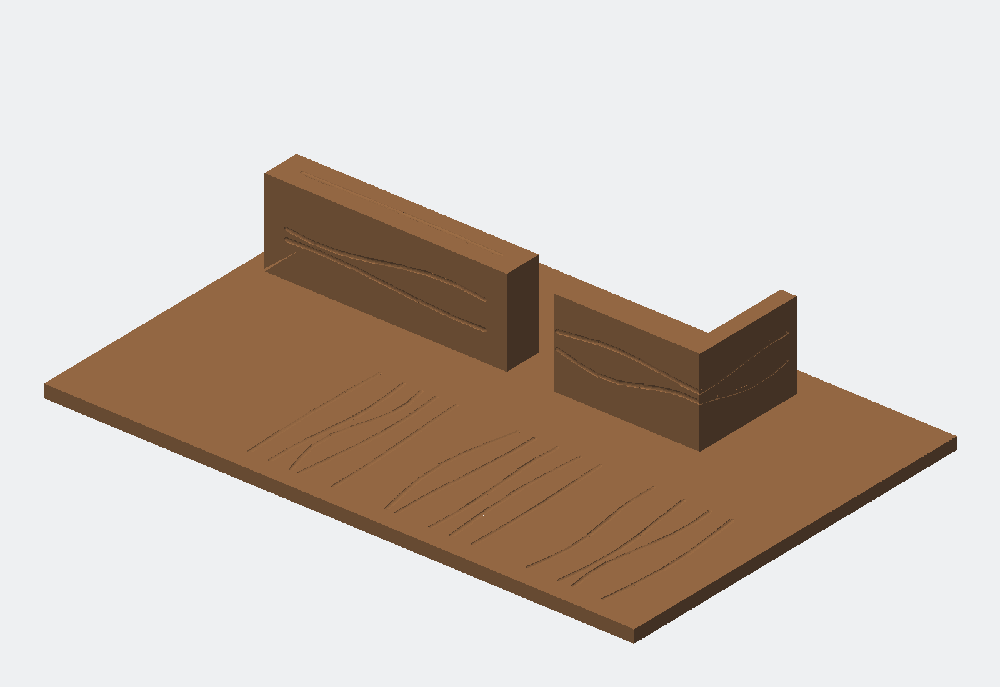

# Schubladen-Organizer R2 – kompakte prozedurale Holzoptik (DRAFT)

Parametrische, vierteilige FDM-Schubladeneinlage für 360 × 230 × 80 mm Innenmaß. Der Organizer nutzt 227 × 357 × 64 mm und lässt nominell 1,5 mm Spiel je XY-Seite.

> **Status:** R2-Anforderungen und `concept-R2-v5.png` sind freigegeben. Vier Hauptmodule, Kamm, Coupons und Vierobjekt-3MF bestehen die digitale Prüfung. Die Dateien bleiben `DRAFT`: exakte Slicerprüfung, physische Pass-/Holztexturproben, R2-Wasserzeichenintegration und finale Freigabe fehlen noch.



## Aufbau

- Vier steckbare Hauptmodule, jeweils höchstens 135 × 186,5 mm Druckfläche.
- Linke 92-mm-Zone für lange Schraubendreher; separater Kamm mit acht Schaftplätzen.
- Rechte 135-mm-Zone mit acht Hardwarefächern in 2 × 4 Anordnung.
- 2,6-mm-Boden und 3,2-mm-Basiswandstärke.
- Acht U-Griffnuten mit 22 mm Breite, 8 mm Tiefe und 4-mm-Bodenradius.
- Vollhohe glatte Wandknoten mit 4,0-mm-T- und 5,5-mm-Kreuzungsblenden.
- Flache, supportfreie Druckorientierung und Puzzleverbinder mit 0,30 mm Nennspiel.

## Holzoberfläche

R2 verwendet keine Bildtextur und keine Fertigungs-Heightmap. Die sichtbare Holzoptik entsteht aus deterministischen Vektor-/Splinekurven mit gespeichertem Seed `20260820`:

- 0,90 mm breite, rein vertiefte und abgerundete Maserungsnuten;
- 0,20 mm Tiefe auf Böden und sicheren Oberseiten;
- 0,16 mm Tiefe auf sichtbaren inneren Wandseiten;
- wenige große, verschachtelte Astkonturen nur auf geeigneten Bodenfeldern;
- globale Front-zu-Rücken-Richtung auf Böden, lokale Längsrichtung auf Wänden und Oberseiten;
- warme, matte Holzfarbe über ungefülltes PETG; Mikrofaser-/Poreneffekte werden nicht geometrisch modelliert.

Außenwände, Unterseiten, Modultrennflächen, Verbinder, Kamm-Passflächen, Griffnutradien, Wandwurzeln und verrundete Knoten bleiben geometrisch glatt.

## Rebuild und Prüfung

Im Projektverzeichnis:

```bash
python3 rebuild.py
```

Der Befehl baut die vier Module nacheinander, erzeugt Kamm und Coupons, exportiert neun R2-STLs, paketiert die Vierobjekt-3MF und führt Hash-, Topologie-, Oberflächenumfang-, Restwand-, Ressourcen- und 3MF-Prüfungen aus. R2 akzeptiert absichtlich kein Texturbild und kein `--prepare-only`.

Nur vorhandene Ausgaben erneut prüfen:

```bash
python3 src/build_pipeline.py --validate-only
```

Quelltests:

```bash
node src/test_mesh_export.mjs
node src/test_procedural_wood.mjs
python3 -m unittest src.test_r2_pipeline
```

## Digitales Ergebnis

| Kennwert | R2 DRAFT |
|---|---:|
| Hauptmodule | 4 |
| STLs einschließlich Kamm/Coupons | 9/9 PASS |
| Dreiecke der vier Hauptmodule | 426.832 |
| STL-Bytes der vier Hauptmodule | 21.341.936 |
| Dreiecksreduktion gegen R1.3 | 92,9206 % |
| STL-Byte-Reduktion gegen R1.3 | 92,9205 % |
| Baugruppenhülle | 227 × 357 × 64 mm |
| 3MF | 4 benannte Objekte und Build-Items; CRC/Core-Namensraum PASS |

Jede STL ist watertight/manifold, konsistent orientiert, volumenhaltig, einteilig und frei von Null- oder Duplikatflächen. Zusätzliche verlustbehaftete Mesh-Decimation wurde als nicht vorteilhaft verworfen; die parametrische Holzrepräsentation erreicht die Ressourcenbudgets bereits.

## Drucken und Qualifikation

1. Eckcoupon in der realen Schublade prüfen.
2. Männlichen und weiblichen Connector-Coupon drucken und Steckspiel bewerten.
3. Holztexturcoupon unter dem geplanten PETG-Profil drucken; Erkennbarkeit, Haptik, Reinigung und Eck-/Topübergang prüfen.
4. Im Slicer alle Wände, Nuten, ersten Schichten, Verbinder und Supportfreiheit kontrollieren und die R1.3-/R2-Import- plus Slice-Zeit vergleichen.
5. Erst danach ein Hauptmodul als Probemodul drucken.

Die Hauptmodule liegen mit der geschlossenen Unterseite flach auf dem Bett. Standard ist ungefülltes warmbraunes PETG, 0,4-mm-Düse, 0,45-mm-Nennlinienbreite und 0,20-mm-Schichthöhe. Herstellerprofil und reale Kalibrierung bleiben maßgeblich.

## Wichtige Dateien

- `design-spec.yaml` – freigegebene Anforderungen und aktueller Gate-Status
- `config/model-params.json` – Organizer- und Exportparameter
- `config/wood-texture-params.json` – Holzmaserung, Seed, Keep-outs und Ressourcenbudgets
- `src/procedural_wood.mjs` – deterministische Oberflächenplanung
- `src/manifold_model.mjs` – parametrische Kern- und Texturgeometrie
- `src/mesh_export.mjs` – strikte Float32-Exportsanitation
- `src/build_pipeline.py` – Build-, Paket- und Validierungssteuerung
- `reports/R2-procedural-wood-digital-validation.json` – maßgeblicher digitaler Prüfbericht
- `output/DRAFT/DRAFT-R2-procedural-wood-assembly.3mf` – unmarkierte DRAFT-Baugruppe

R1.3 bleibt als unveränderte bildbasierte Stahl-Heightmap-Baseline erhalten. R2 ruft diese Pipeline nicht auf.
