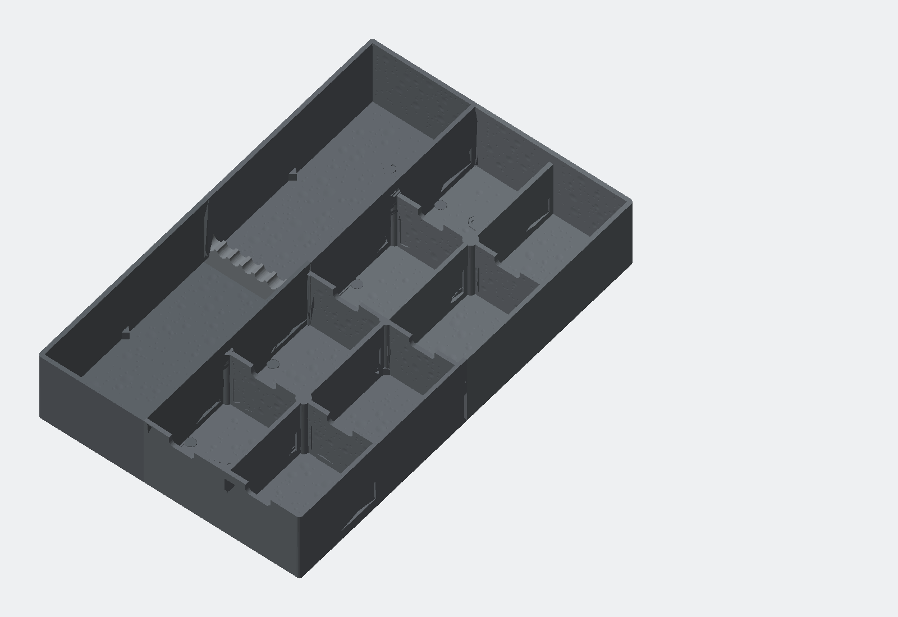

# Schubladen-Organizer R1.4 – prozedurale Stahltextur (DRAFT)

Parametrische, vierteilige FDM-Einlage für eine Schublade mit 360 × 230 × 80 mm Innenmaß. Die Baugruppe belegt 227 × 357 × 64 mm und lässt nominell 1,5 mm Spiel je XY-Seite.

> **Status:** Anforderungen und Konzept der R1.4-Oberfläche sind freigegeben. Alle neun STL-Netze und der 3MF-Container sind digital geprüft. Die Dateien bleiben `DRAFT`, bis Textur und Verbinder mit realen Coupons sowie die ersten kennzeichnungstragenden Schichten im Ziel-Slicer bestätigt wurden.



## Was R1.4 ändert

- Die frühere Bildgravur ist aus dem aktiven Build und aus dem Release-ZIP entfernt.
- Es gibt kein Bild-Fit, kein Stretching und keine bildabhängige Seitenverhältnis-Skalierung mehr.
- Eine deterministische, mehrskalige Schmiede-/Gussstahlstruktur wird direkt als analytische flache Vertiefung erzeugt.
- Texturiert werden alle beim Öffnen sichtbaren Innenflächen: Fachböden, innere Seitenwände und Wandoberseiten.
- Außenwände, Steckverbinder, Wandknoten, Griffnuten, Gussets, Bettauflage und Unterseitenkennzeichnung bleiben glatt.
- Die Verbinderkonturen entsprechen unverändert R1.3; eine gemeldete reale Passungsabweichung ist deshalb noch nicht als behoben qualifiziert.

## Ein einfacher Befehl

```bash
python3 rebuild.py
```

Der Befehl liest alle Werte aus `config/model-params.json` und `config/surface-texture.json`, baut die vier Hauptmodule nacheinander, baut Zubehör und Coupons, repariert ausschließlich numerische STL-Mikrokanten, erzeugt die 3MF-Datei, prüft Netze/Texture-Keep-outs/Connector-Regression/Speicher/3MF und erstellt das Revisions-ZIP.

Einmalig, falls Python-Abhängigkeiten fehlen:

```bash
python3 -m pip install -r requirements.txt
```

Fehlende gesperrte Node-Abhängigkeiten installiert `rebuild.py` beim ersten Lauf automatisch mit `npm ci`.

## Oberflächenparameter

`config/surface-texture.json` ist die alleinige Texturquelle. Wichtige freigegebene Werte:

| Fläche | Merkmalsfamilien | maximale Tiefe | kleinster Nenndurchmesser |
|---|---|---:|---:|
| Innenboden | Makro + Meso | 0,28 mm | 1,3 mm |
| Innere Wände | Makro + Meso | 0,23 mm | 1,3 mm |
| Wandoberseiten | feine Dellen | 0,13 mm | 1,1 mm |

Der feste Seed `140421` macht jeden Build reproduzierbar. Die Darstellung ist absichtlich nicht als mikroskopischer Kratzerteppich modelliert: metallische Wirkung unterhalb der Düsenauflösung kommt aus Graphit-/Metall-PETG, Extrusionsrichtung und Licht. So bleibt die Geometrie druckbar, reinigbar und speichereffizient.

## Speicherstrategie

- Ein Hauptmodul pro isoliertem Node/WASM-Prozess.
- Innerhalb eines Moduls jeweils nur ein Texturpatch zur Zeit.
- Gebündelte Dellen-CSG-Operationen und sofortiges Freigeben von Zwischenkörpern.
- STL-Reparatur und Topologieprüfung je Datei; 3MF anschließend aus den validierten Netzen.
- Node-Heap-Grenze 2.048 MB; Warnziel 1.536 MiB; harter Abbruchwert 3.072 MiB Peak-RSS.

Der aktuelle gemessene Worst Case liegt bei 326,215 MiB Peak-RSS, also 0,319 GiB beziehungsweise 0,342 GB dezimal. 4 GB verfügbarer RAM reichen für diesen isolierten Build vernünftig aus; 8 GB System-RAM geben Reserve für Betriebssystem und Slicer.

Die frühere 0,30-mm-Rasterpitch-Anforderung entfällt: R1.4 besitzt kein Heightmap-Raster. Die kleinste CAD-Textur ist 1,1 mm breit und damit für eine 0,40-mm-Düse wesentlich robuster als ein 0,30-mm-Bildraster.

## Drucken und qualifizieren

1. `DRAFT-steel-texture-coupon.stl` drucken; das mittlere Feld ist die freigegebene Tiefe, daneben liegen 75-%- und 120-%-Varianten.
2. Beide Connector-Coupons zusammen drucken. Sie müssen von Hand fügbar sein, dürfen aber im eingelegten Zustand nicht klaffen.
3. `DRAFT-drawer-fit-corner-coupon.stl` im realen Schubladenrand prüfen.
4. Im Ziel-Slicer die ersten drei Schichten, alle Wände, glatten Keep-outs und die Unterseitenkennzeichnung kontrollieren.
5. Erst dann ein Hauptmodul drucken und die reale Passung dokumentieren.

Das PETG-Startprofil steht in `print-profile.md`. Temperaturen, Fluss und maximale Volumenrate folgen dem konkreten Filamentprofil.

## Lieferumfang

- Vier Hauptmodul-STLs und eine positionierte Baugruppen-3MF
- Schraubendreherkamm
- Stahltextur-, Connector- und Eckpassungs-Coupons
- Parametrische Manifold3D-Quelle und versionierte JSON-Parameter
- Mesh-, Speicher-, 3MF-, Textur-, Hash- und Kennzeichnungsnachweise
- Render, Montageplan, BOM und Druckprofil

Ein STEP-Export ist nicht enthalten, weil die Fertigungsgeometrie als reproduzierbarer JavaScript-/Manifold3D-Master aufgebaut wird.

## Wichtige Dateien

- `rebuild.py` – parameterloser Gesamtbuild
- `config/model-params.json` – Organizer-, Connector-, Export- und Kennzeichnungswerte
- `config/surface-texture.json` – Textur, Keep-outs, Finish und Speicherbudgets
- `src/manifold_model.mjs` – parametrische Geometrie
- `src/surface_texture.mjs` – deterministische analytische Dellenfelder
- `src/build_pipeline.py` – sequenzielle Build-/Prüfsteuerung
- `src/validate_surface_texture.py` – Oberflächen-, Reserve-, Connector-, Speicher- und 3MF-Gate
- `reports/validation-report.md` – zusammengefasster Freigabestatus
