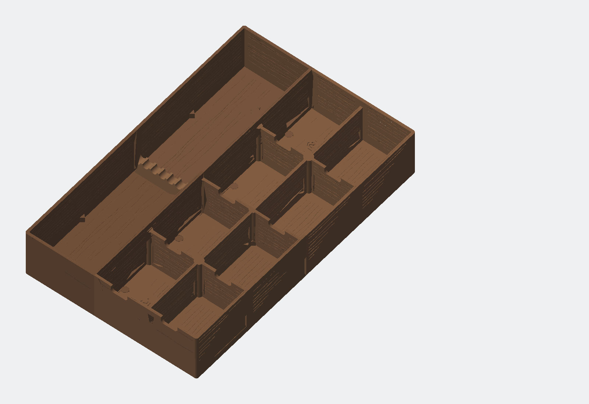

# Schubladen-Organizer R1.5 – prozedurale Walnussstruktur (DRAFT)

Vierteilige, parametrische FDM-Schubladeneinlage mit feiner gerichteter Holzmaserung. Die Baugruppe ist 227 × 357 × 64 mm groß, besitzt eine lange Schraubendreherzone mit herausnehmbarem 8-fach-Kamm und acht Kleinteilfächer.

> **Status:** Die R1.5-Geometrie ist digital validiert. Sie bleibt `DRAFT`, weil Holzoptik, Haptik und die bereits gemeldete reale Connector-Nichtpassung noch mit den enthaltenen Coupons geprüft werden müssen. Eine exakte Ziel-Slicer-Prüfung steht ebenfalls aus.



## Was R1.5 ändert

- Die frühere Bildgravur ist vollständig inaktiv; es gibt keine Bildskalierung, kein Stretching und kein Seitenverhältnisrisiko.
- Die Maserung wird deterministisch als flache, kontinuierliche Vektor-/CAD-Nut erzeugt.
- Innenböden laufen global von vorn nach hinten; Wandflächen folgen ihrer Längsachse; Wandoberseiten erhalten eine geschützte Mittellinie.
- Drei Module besitzen je einen sparsamen dreifachen Astkontur-Ring; das vierte bleibt bewusst astfrei.
- Außenwände, Connectoren, Wandknoten, Griffnuten, Gussets, Wandwurzeln, Bettauflage und Kennzeichnungszonen bleiben glatt.
- Organizerabmessungen, Fächer, Kamm und die runden Puzzle-Connectoren sind gegenüber R1.4 unverändert.

## Ein Befehl

```bash
python3 rebuild.py
```

Alle Werte werden aus `config/model-params.json` und `config/surface-texture.json` gelesen. Der Build verarbeitet jedes Hauptmodul in einem eigenen Prozess, prüft alle STLs, erzeugt die 3MF-Datei, rendert Vorschauen und erstellt das Revisions-ZIP.

Falls Python-Pakete fehlen:

```bash
python3 -m pip install -r requirements.txt
```

Gesperrte Node-Abhängigkeiten werden beim ersten Build automatisch mit `npm ci` installiert.

## Textursystem

| Fläche | Geometrie | maximale Tiefe |
|---|---|---:|
| Innenböden | lange wellige Maserung, optionale Astkonturen | 0,20 mm |
| innere Wandflächen | gerichtete wellige Maserung | 0,17 mm |
| Wandoberseiten | eine geschützte Mittellinienmaserung | 0,12 mm |

Der feste Seed `150521` macht die Ausgabe reproduzierbar. Sub-Düsen-Fasern werden nicht als Mikroriefen modelliert: Filamentfarbe, matte Oberfläche und Extrusionsrichtung liefern diesen optischen Maßstab. Das hält die Oberfläche druckbar, reinigbar und speichereffizient.

## Speicher und Komplexität

- Ein Hauptmodul pro isoliertem Node/WASM-Prozess.
- Ein Oberflächenpatch pro Boolean-Stufe; Zwischenkörper werden sofort freigegeben.
- Gemessener Worst Case: **164,75 MiB = 0,161 GiB = 0,173 GB dezimal** Peak-RSS.
- Konfiguriertes Ziel: 1.536 MiB; harter Stop: 3.072 MiB.
- Größtes Netz: 40.384 Dreiecke; Review-Grenze: 1.000.000.

Damit reichen 4 GB verfügbarer RAM für den Build komfortabel aus; 8 GB System-RAM bieten zusätzliche Reserve für Betriebssystem und Slicer.

## Empfohlener Druckstart

1. `DRAFT-walnut-texture-coupon.stl` in mattem walnussbraunem PETG drucken. Die Bodenfelder zeigen fein/freigegeben/grob, dazu Wand, Wandtop und Astkontur.
2. Beide Connector-Coupons auf demselben Bett drucken und Istmaße/Fügegefühl dokumentieren. Die Geometrie ist byte-identisch zu R1.4 und löst die gemeldete Nichtpassung noch nicht.
3. Den Eckcoupon im realen Schubladenrand prüfen.
4. Die 3MF im Ziel-Slicer öffnen und erste drei Schichten, Wände, Texturnuten, glatte Keep-outs und Unterseitenkennzeichnung prüfen.
5. Erst danach ein Hauptmodul drucken.

## Lieferumfang

- Vier Hauptmodul-STLs und positionierte 4-Objekt-3MF
- Schraubendreherkamm
- Walnuss-, Connector- und Eckpassungs-Coupons
- Parametrische Manifold3D-Quelle und JSON-Parameter
- Konzeptbild, tatsächliche STL-Render, Montageplan, BOM und Druckprofil
- Mesh-, Speicher-, 3MF-, Textur-, Hash- und Kennzeichnungsnachweise

Ein STEP-Export ist nicht enthalten; der editierbare Master ist die reproduzierbare JavaScript-/Manifold3D-Geometrie.

## Wichtige Dateien

- `rebuild.py` – parameterloser Gesamtbuild
- `config/model-params.json` – Organizer-, Connector-, Export- und Kennzeichnungswerte
- `config/surface-texture.json` – Maserung, Äste, Keep-outs, Finish und Speicherbudgets
- `src/manifold_model.mjs` – parametrische Produktgeometrie und Flächenmapping
- `src/surface_texture.mjs` – deterministische Nut- und Astkonturgeometrie
- `src/build_pipeline.py` – speichereffiziente Sequenz
- `reports/validation-report.md` – digitaler Prüfstatus
