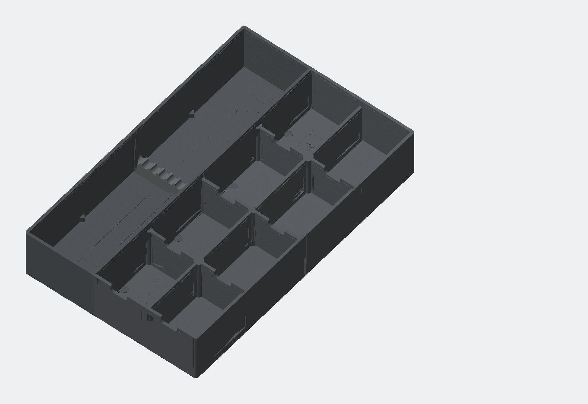

# Schubladen-Organizer R1.6 – parametrische Oberflächen (DRAFT)

R1.6 übernimmt die funktionale Organizer-Geometrie aus R1.5 unverändert und macht ausschließlich die sichtbare Oberflächenfamilie austauschbar. Es gibt zwei Carbonprofile: den ursprünglichen diagonalen 2×2-Twill und `carbon-wave`, ein aus `libraries/carbonfiber1.png` abgeleitetes 0/90-Korbgewebe. Neu hinzugekommen ist `micro-cast`: eine lochfreie, matte Gussstruktur zum optischen Brechen der FDM-Linien. Walnuss aus R1.5, Stahl aus R1.4 und eine vollständig glatte Variante bleiben mit derselben Quelle rebuildbar.

> **Status:** digital validierter DRAFT. Oberflächenwirkung, Haptik, Reinigbarkeit, Ziel-Slicer-Pfade sowie die bereits bekannte reale Connector-Nichtpassung benötigen weiterhin Coupons und eine Slicerprüfung.



## Rebuild

```bash
python3 rebuild.py --surface carbon
python3 rebuild.py --surface carbon-wave
python3 rebuild.py --surface micro-cast
python3 rebuild.py --surface walnut
python3 rebuild.py --surface steel
python3 rebuild.py --surface plain
```

Ohne `--surface` wird `default_profile` aus `config/surface-texture.json` verwendet. Der Build verändert keine Konfigurationsdatei. Haupt-STLs und gemeinsame Reports bilden immer den zuletzt gebauten Modus ab; 3MF und ZIP tragen den Profilnamen.

## Carbonoberflächen

`carbon` verwendet ein deterministisches 2×2-Twill-Feld mit wechselnden ±45°-Richtungen. `carbon-wave` bildet die Referenz `libraries/carbonfiber1.png` als kompaktes Korbgewebe nach: je zwei breite Tow-Bündel füllen einen Block, benachbarte Blöcke wechseln zwischen 0° und 90° und versetzen sich diagonal. Horizontal liegende Bündel sind tiefer und damit optisch dominanter. Drei flache Längsrippen pro breitem Bündel erzeugen gerichtete Highlights; einzelne Carbonfilamente bleiben Material- und Toolpathwirkung.

| Fläche | Pitch | Zellenbreite | maximale Tiefe |
|---|---:|---:|---:|
| Innenböden | 3,00 mm | 1,05 mm | 0,18 mm |
| innere Wandflächen | 3,15 mm | 1,00 mm | 0,16 mm |
| Wandoberseiten | 2,60 mm | 0,55 mm | 0,10 mm |

Für `carbon-wave` beträgt das Zellraster 2,20 mm am Boden und 2,25 mm an Innenwänden; Tow-Bündel sind dort 3,92–4,00 mm lang und 1,78–1,82 mm breit. Die maximale subtraktive Tiefe bleibt bei 0,18/0,16/0,09 mm.

Die Struktur ist nur Carbonoptik. Sie verleiht dem Druckteil keine Eigenschaften eines Carbonlaminats.

## Lochfreie Micro-Cast-Oberfläche

`micro-cast` legt ein deterministisches, zusammenhängendes Feld unregelmäßiger Mikrofacetten **additiv** auf Innenböden und innere Wandflächen. Das 1,60-mm-Raster ist bewusst oberhalb der 0,44-mm-Linienbreite bandbegrenzt; feinere Porenwirkung bleibt dem matten Material und optionalen Slicer-Finish überlassen. Böden haben höchstens 0,24 mm, Innenwände höchstens 0,20 mm Erhebung. Es werden keine Vertiefungen oder Mulden eingeschnitten.

Wandoberseiten sind bei diesem Profil geometrisch vollständig glatt. Für horizontale Flächen ist ein einheitlicher monotoner Top-Pfad vorgesehen; optionales Ironing oder sehr mildes, nur auf Wände gemaltes Fuzzy Skin wird erst nach einem Coupon empfohlen. Das geerbte Profil `steel` bleibt unverändert auswählbar.

## Geschützte Geometrie

Unabhängig vom Profil bleiben Außenwände, Connectoren, Wandknoten, Griffnuten, Gussets, Wandwurzeln, Bettauflage und Kennzeichnungszonen glatt. Organizerhülle, Fächer, Kamm, Wandstärken und Connector-Nennfreigabe werden nicht umkonstruiert. Die geerbten Profile sind flach und subtraktiv; `micro-cast` ist ausschließlich additiv und `plain` deaktiviert optionale Oberflächengeometrie vollständig.

## Parameterstruktur

- `config/surface-texture.json` – Profilselektor und Default
- `config/surfaces/carbon.json` – Twillmaßstab, Tiefen, Finish und Budgets
- `config/surfaces/carbon-wave.json` – referenzabgeleitetes 0/90-Korbgewebe
- `config/surfaces/micro-cast.json` – additive lochfreie Mikrofacetten und glatte Wandtops
- `config/surfaces/walnut.json` – unveränderte R1.5-Maserungsfamilie
- `config/surfaces/steel.json` – unveränderte R1.4-Schmiedestahlfamilie
- `config/surfaces/plain.json` – Nulltextur-Baseline
- `src/surface_texture.mjs` – kleiner Profil-Dispatcher
- `src/textures/*.mjs` – voneinander getrennte prozedurale Generatoren

## Empfohlene Freigabereihenfolge

1. `DRAFT-surface-texture-coupon.stl` im gewählten Material drucken und unter mindestens drei Lichtwinkeln prüfen.
2. Connector-Coupons gemeinsam drucken und Istmaße/Fügegefühl dokumentieren.
3. Eckcoupon im realen Schubladenrand prüfen.
4. Profilbenannte 3MF im Ziel-Slicer öffnen; erste drei Schichten, kurze Texturpfade, Wandoberseiten, glatte Keep-outs und Unterseitenkennzeichnung prüfen.
5. Erst danach ein Hauptmodul drucken.

Die Herstellungsdateien bleiben `DRAFT`, bis diese physischen und Slicer-Prüfungen bestanden sind.

## Digitaler Buildstatus

- 9/9 STL-Dateien: watertight, manifold, einteilig, positiv volumig
- Hauptmodule im zuletzt gebauten `micro-cast`-Profil: 37.258–55.594 Dreiecke; keine Sliver-Reparatur erforderlich
- 3MF: vier positionierte Objekte, 227 × 357 × 64 mm, CRC PASS
- Connector-Coupons: byte-identisch zu R1.4
- Micro-Cast-Tiefen: 0,00 mm; beobachtete Maximalerhebung 0,231 mm Boden / 0,194 mm Innenwand / 0,000 mm Wandtop
- Peak-RSS: 276,03 MiB; unter dem 1.536-MiB-Ziel
- Release-ZIP: CRC PASS

Details stehen in `reports/validation-report.md` und `reports/surface-texture-validation.json`.
