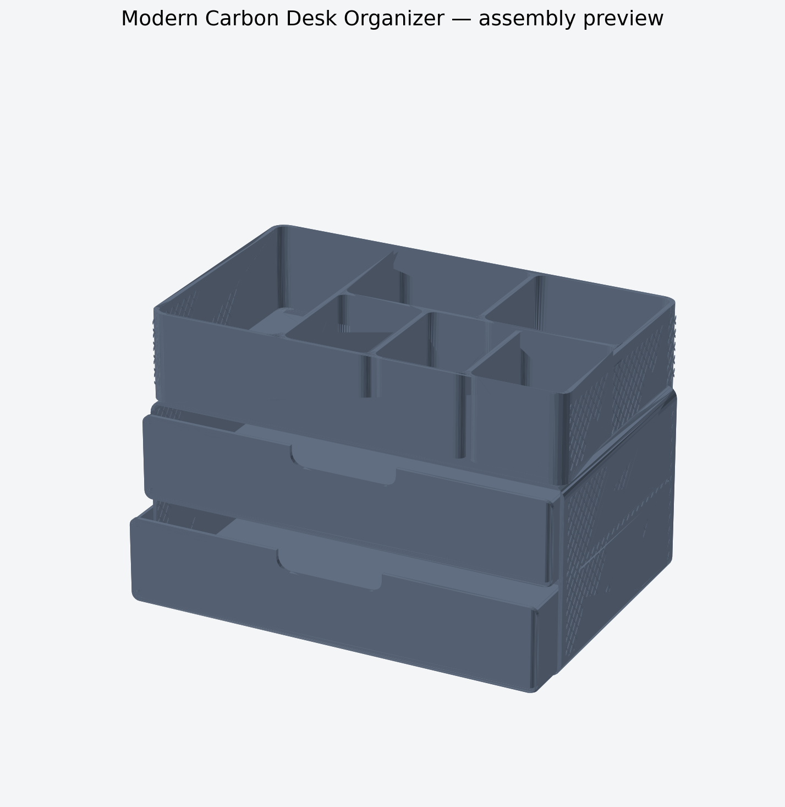

# Moderner Carbon Desk Organizer

Großer, parametrierbarer FDM-Organizer mit zwei identischen Schubladen, sechs offenen Sortierfächern, abgerundeten Konturen und einem geometrisch modellierten Carbon-Twill auf den linken und rechten Außenseiten.



## Abmessungen

| Merkmal | Maß |
|---|---:|
| Außenmaß montiert | 320,7 × 230 × 216,8 mm |
| Schubladengehäuse | 320,7 × 230 × 148,8 mm einschließlich Steckzapfen |
| Schubladenfront | 316 × 65,2 mm |
| Top-Sorter | 320,7 × 230 × 68 mm |
| Sortierfächer | 6 |
| Carbon-Relief | 0,26 / 0,34 mm hoch, 7,2 mm Teilung |

Die Bauteile passen in den offiziellen Bauraum des Anycubic Kobra 3 Max von 420 × 420 × 500 mm. Das Gehäuse ist bereits auf der Rückseite liegend exportiert und belegt auf dem Druckbett etwa 320,7 × 148,8 mm; seine Druckhöhe beträgt 230 mm.

## Dateien

- `output/stl/01_housing_print_on_back.stl` — Gehäuse, bereits druckorientiert
- `output/stl/02_drawer_print_twice.stl` — identische Schublade, zweimal drucken
- `output/stl/03_top_sorter_print_bottom_down.stl` — Top-Sorter
- `output/stl/04_fit_coupon_optional.stl` — Passungslehre mit 0,30 / 0,45 / 0,60 mm Spiel je Seite
- `output/stl/05_carbon_texture_coupon_optional.stl` — senkrechte Carbon-Reliefprobe
- `output/assembly/desk_organizer_assembly_preview.stl` — nur Vorschau, nicht als ein Teil drucken
- `src/desk_organizer.mjs` — editierbarer parametrischer Quellcode
- `model_parameters.json` und `design-spec.yaml` — Maße und Designvertrag
- `output/validation-report.json` — unabhängige Mesh-Prüfung

## Carbon-Optik

Das Muster ist echte, flache Geometrie und keine reine Rendertextur. Zwei diagonale Strangfamilien mit unterschiedlichen Höhen erzeugen einen Twill-Effekt. Die Struktur ist kosmetisch; sie macht PLA oder PETG nicht zu einem Carbon-Verbundwerkstoff. Für die stärkste optische Wirkung eignet sich mattes schwarzes PLA/PLA+. Bei echtem PLA-CF oder PETG-CF sind eine verschleißfeste Düse und das Herstellerprofil erforderlich.

## Schnellstart

1. Zuerst `04_fit_coupon_optional.stl` und `05_carbon_texture_coupon_optional.stl` drucken.
2. Bei gutem Sitz und sichtbarer Textur das Gehäuse, eine Schublade und den Sorter slicen.
3. `02_drawer_print_twice.stl` insgesamt zweimal drucken.
4. Schubladen einschieben und den Sorter mit seinen vier Bodentaschen auf die vier Gehäusezapfen setzen.

Die detaillierten Einstellungen stehen in `PRINT-GUIDE.md`.

## Neu erzeugen

Voraussetzung: Node.js 20+ und Python 3.10+.

```bash
npm install
npm run build
npm run validate
npm run preview
python3 tools/generate_carbon_heightmap.py
```

Die Hauptparameter stehen am Anfang von `src/desk_organizer.mjs`. Nach einer Änderung immer neu bauen und validieren. Die Standard-Schublade verwendet 0,45 mm Spiel je Seite. Soll das Coupon-Ergebnis geändert werden, muss `drawerBodyWidth` entsprechend angepasst werden:

| Gewünschtes Spiel je Seite | `drawerBodyWidth` |
|---:|---:|
| 0,30 mm | 313,0 mm |
| 0,45 mm | 312,7 mm |
| 0,60 mm | 312,4 mm |

## Status und Grenzen

Die exportierten Meshes bestehen die V1-Prüfung auf geschlossene Kanten, konsistente Orientierung, positive Volumina, erwartete Körperzahl und Bauraum. Ein realer Slicer-Durchlauf und ein physischer Druck sind noch nicht erfolgt; der Entwurf bleibt daher `experimental`. Die Schubladen sind absichtlich vollständig herausnehmbar und besitzen keinen harten Auszugsstopp.

Quellenhinweis zum Drucker: [Anycubic Kobra 3 Max – offizielle Produktdaten](https://store.anycubic.com/products/kobra-3-max).
