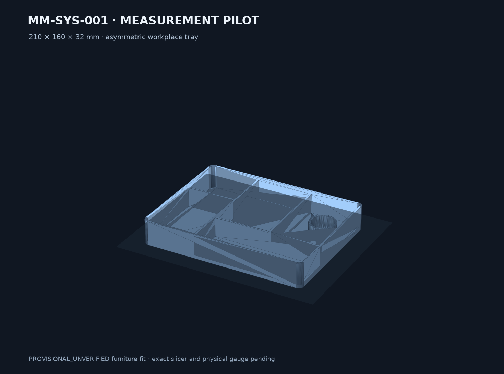

# MM-SYS-001 Inventory Workplace Tray measurement pilot

This is the product-specific PORT-039 package. It converts the shared system-furniture concept into a fully parameterized common-220 design with a controlled fit-learning sequence.

Current status: **DRAFT digital geometry candidate / PROVISIONAL_UNVERIFIED furniture fit**. The geometry is printable in the digital sense; it is not evidence that a particular ALEX revision fits.



## Package

- one 210 × 160 × 32 mm asymmetric tray
- one 209.30 mm full-width gauge, marked with one tab
- one 210.00 mm full-width gauge, marked with two tabs
- one 210.70 mm full-width gauge, marked with three tabs
- JSON parameter source and standalone CadQuery builder
- STEP and STL for every part
- valid four-object DRAFT 3MF inventory set

The gauge ladder represents nominal width ±0.70 mm, corresponding to the provisional 0.35 mm per-side clearance. It does not replace measuring the actual drawer.

## Build

From this directory:

```sh
python3 -u cad/build_alex_tray.py
```

The builder regenerates every STEP/STL/3MF artifact and hash-bound source/interface report. `model-parameters.json` is the sole numeric source of truth.

## Main output

`exports/3mf/DRAFT-MM-SYS-001-alex-measurement-pilot-0.2.0-draft.1.3mf`

This is an inventory package. Arrange the tray and only the selected gauge on separate plates; the encoded build-item positions are not a ready-to-print plate layout.

## Release boundary

Do not advertise exact ALEX compatibility, load capacity, drawer safety or commercial readiness. Record the exact system/article/revision and three-point internal measurements, print the gauges, and regenerate the envelope if required. Exact slicing and physical validation remain open.
