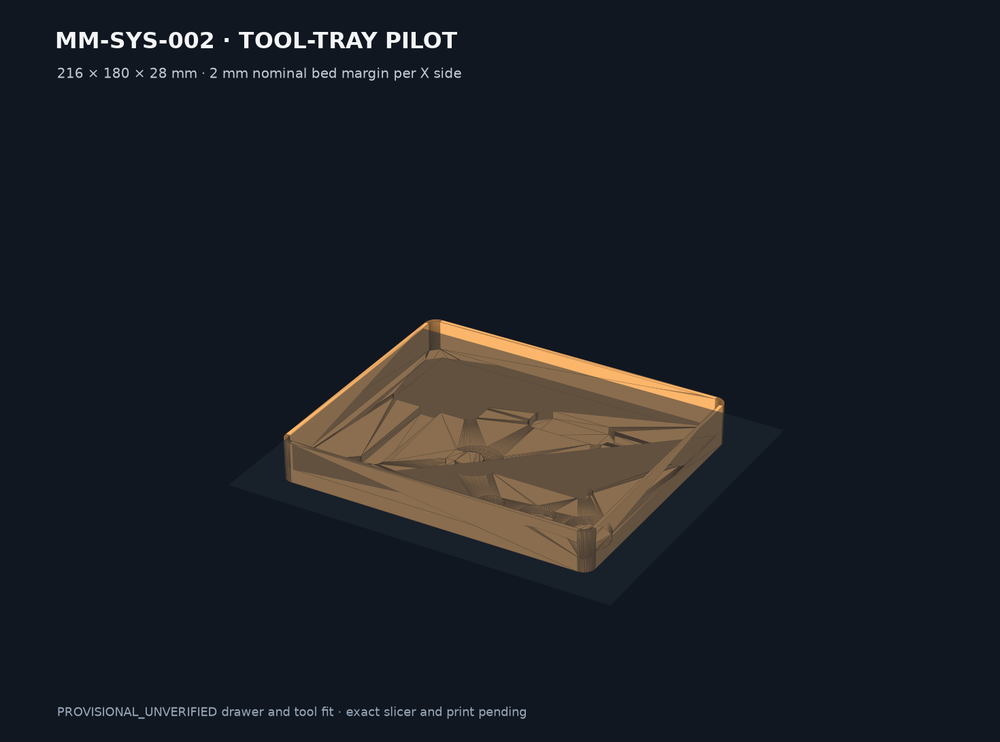

# MM-SYS-002 BROR Tool Shadow Tray measurement pilot

This PORT-040 package is a fully parameterized common-220 shadow-tray concept with explicit furniture and tool uncertainty.

Status: **DRAFT digital geometry candidate / PROVISIONAL_UNVERIFIED drawer and tool fit**.



## Package

- 216 × 180 × 28 mm tray, leaving 2 mm nominal X bed margin on a 220 mm plate
- protected 2.40 mm floor ligament below 5.40 mm tool recesses
- JSON-controlled hammer, screwdriver, open-wrench and three socket-zone recesses
- three full-width gauges: 215.30, 216.00 and 216.70 mm
- STEP/STL plus valid four-object DRAFT 3MF

Build from this directory with:

```sh
python3 -u cad/build_bror_tray.py
```

Primary output: `exports/3mf/DRAFT-MM-SYS-002-bror-measurement-pilot-0.2.0-draft.1.3mf`.

The 3MF is an inventory set. Arrange the tray and a selected gauge on separate plates. BROR and the depicted tool families identify the intended measurement exercise only; they are not guaranteed compatibility claims.
