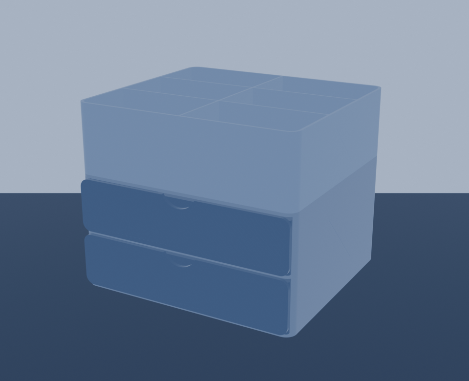

# MM-ORG-003 Modern Carbon Desk Organizer Compact

This is the common-220-printer derivative of PORT-004. It is a fully parameterized CadQuery design consisting of one two-bay housing, one drawer printed twice, one removable 2 × 3 top sorter, and process-matched fit and texture coupons.

Current status: **DRAFT digital engineering candidate**. Parametric source, manufacturing meshes, 3MF structure, build-volume checks and nominal interfaces pass. Exact slicing and physical qualification are intentionally open.



## Controlled dimensions

- assembled envelope: 210 × 193.2 × 173 mm, including the 3.2 mm proud drawer fascia
- housing: 210 × 190 × 108 mm
- drawer, quantity two: 205.6 × 185.1 × 49 mm manufacturing envelope
- sorter: 210 × 190 × 65 mm, six cells
- drawer side clearance: 0.45 mm per side
- drawer top/rear clearance: 3.0 / 5.7 mm
- stack peg/socket clearance: 0.35 mm per side
- target build volume: 220 × 220 × 250 mm

The source of truth is `model-parameters.json`. `design-spec.yaml` owns the requirements and acceptance contract; `cad/build_compact_organizer.py` owns geometry.

## Rebuild

CadQuery and Trimesh are required. To keep OCCT peak memory bounded, build each part in a separate process from this directory:

```sh
python3 cad/build.py
python3 cad/check_interfaces.py
```

`python3 cad/build.py` runs each part in a fresh process and then performs the aggregate corner, collision, mesh and package checks.

## Deliverables

- editable source and parameters: `cad/`, `model-parameters.json`
- STEP masters: `exports/master/`
- manufacturing STLs: `exports/manufacturing/`
- DRAFT multi-object 3MF: `exports/3mf/DRAFT-MM-ORG-003-modern-carbon-compact-2.0.0-draft.2.3mf`
- digital reports: `validation/` and `reports/`
- print guidance: `PRINT-GUIDE.md`

The 3MF contains housing, drawer and sorter mesh objects with build items `[housing, drawer, drawer, sorter]`. It is an inventory print set, not a pre-arranged single plate; place unique parts on separate plates before slicing.

## Release boundary

Do not publish load, cycle-life, anti-tip, fit or child-safety claims from this draft. The exact slicer run, coupon prints, unchanged full print, drawer cycling, loaded anti-tip check, appearance check and commercial-release review remain open.
