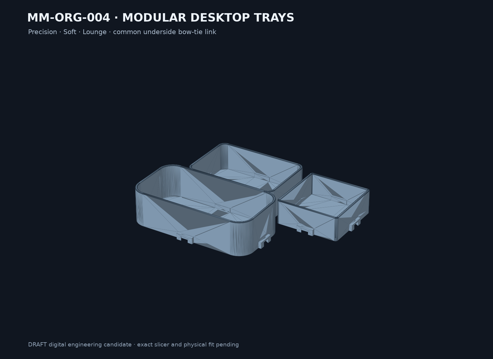

# Final model result — MM-ORG-004

## Result

`SKU-002 Modular desktop tray system` is implemented as a fully parameterized DRAFT digital candidate. The set contains three open-top tray styles, one shared underside bow-tie connector and a small interface coupon. The reference arrangement is 222 × 167 × 40 mm and stays inside the research envelope of 230 × 180 × 45 mm.

## Parts

| Part | Manufacturing envelope | Quantity in print set | Role |
|---|---:|---:|---|
| Precision tray | 83 × 83 × 28 mm incl. receivers | 1 | compact square module |
| Soft tray | 119 × 83 × 34 mm incl. receivers | 1 | medium rounded module |
| Lounge tray | 157 × 83 × 40 mm incl. receivers | 1 | long large-radius module |
| Bow-tie link | 10.4 × 13.01 × 4.7 mm | 2 | underside in-plane retention |
| Interface coupon | 19 × 24.6 × 7.2 mm | separate | first physical fit/bridge test |

## Manufacturing assumptions

- FDM/FFF, bottom-down tray orientation, no generated support intended.
- Starting process only: PLA, 0.4 mm nozzle, 0.45 mm line width, 0.20 mm layer height.
- Ordinary tray wall and floor: 2.4 mm; socket roof reserve: 2.2 mm.
- Socket head clearance: 0.30 mm per side; axial/vertical clearance: 0.30 mm.
- Estimated solid CAD-volume equivalent for the complete three-tray/two-link set: about 182.4 g PLA at 1.24 g/cm³. This is not slicer-deposited mass.

## Delivered artifacts

- Parametric source: `cad/build.py`
- Parameters: `config/model-parameters.json`
- Neutral masters: `exports/master/*.step`
- Manufacturing meshes: `exports/manufacturing/*.stl`
- Coupon: `exports/coupons/DRAFT-MM-ORG-004-interface-coupon-0.1.0-draft.1.stl`
- DRAFT multi-object print set: `exports/3mf/DRAFT-MM-ORG-004-modular-desktop-tray-system-0.1.0-draft.1.3mf`
- Concept contract: `assets/concept/MM-ORG-004-concept-v1.svg`

## Digital evidence

- Three parameter tests pass, including minimum declared wall/floor values.
- Every STL is one watertight, consistently wound, positive-volume component and fits 220 × 220 × 250 mm.
- The 3MF contains four watertight mesh objects and five build items: three trays plus the connector twice.
- Each tray has 8,284 triangles; global mesh simplification is not beneficial.
- Candidate B reduces analytic CAD volume about 18.2% versus the conservative 3.0 mm shell baseline.

## Open validation

No exact slicer profile, G-code, physical fit, bridge, cycle, load, flatness, edge-comfort or appearance result exists. The first print should be the interface coupon, followed by the unchanged full set only after clearance and bridge quality are acceptable. No commercial, fit, strength or safety claim is made.
