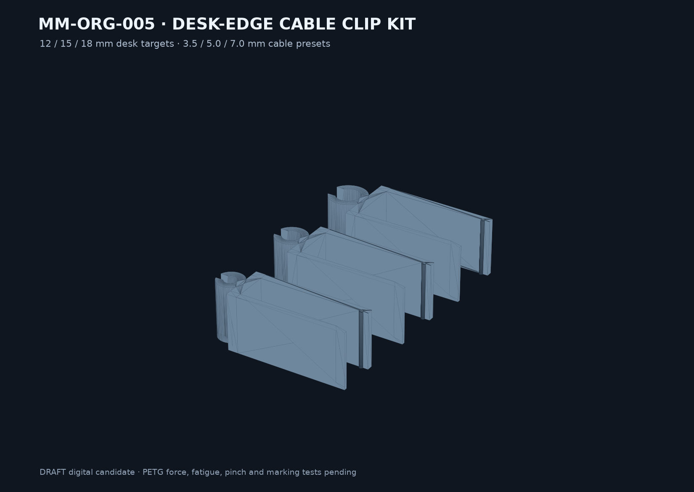

# Final model result — MM-ORG-005

## Result

`SKU-003 Desk-edge cable clip kit` is implemented as a parametric DRAFT digital candidate. The default kit includes three side-printed one-piece PETG clips, matching low-material coupon profiles, a direct desk/cable/count generator and a three-object 3MF.

| Preset | Desk target | Nominal jaw | Cable diameter | Manufacturing envelope |
|---|---:|---:|---:|---:|
| Thin | 12 mm | 10.0 mm | 3.5 mm | 45.62 × 14.4 × 18 mm |
| Standard | 15 mm | 13.0 mm | 5.0 mm | 46.99 × 17.4 × 18 mm |
| Thick | 18 mm | 15.6 mm | 7.0 mm | 48.78 × 20.0 × 18 mm |

## Parametric use

Run `python3 cad/build.py --desk-mm 14.5 --cable-mm 4.2 --count 4 --name order-name` from the product package. Supported default input limits are 10–18 mm desk thickness, 3–8 mm cable diameter and 1–20 clips. Generated geometry remains unqualified until its matching coupon is printed.

## Delivered artifacts

- `cad/build.py` and `config/model-parameters.json`
- three STEP masters and oriented STL meshes
- three 4 mm-wide fit coupon STLs
- `exports/3mf/DRAFT-MM-ORG-005-desk-edge-cable-clip-kit-0.1.0-draft.1.3mf`
- concept, print guide, physical test plan and deterministic reports

## Digital evidence

- Three parameter tests pass, including min/max customer inputs and all default envelopes.
- Every production and coupon mesh is one watertight, consistently wound, positive-volume component.
- Every production clip remains below 80 × 25 × 20 mm in the documented print orientation.
- Cable radial clearance is 0.35 mm; flexure tapers from 2.4 to 1.8 mm.
- Selected analytic CAD volume is about 23.1% below the uniform 3.0 mm arm baseline.

## Open validation

No exact PETG slicer profile, G-code, insertion force, flexure fatigue, cable-pinch, abrasion, release-force or desk-marking result exists. The coupon and the test plan remain mandatory. The model is not electrical insulation, certified strain relief, load-bearing hardware or a commercial release.
