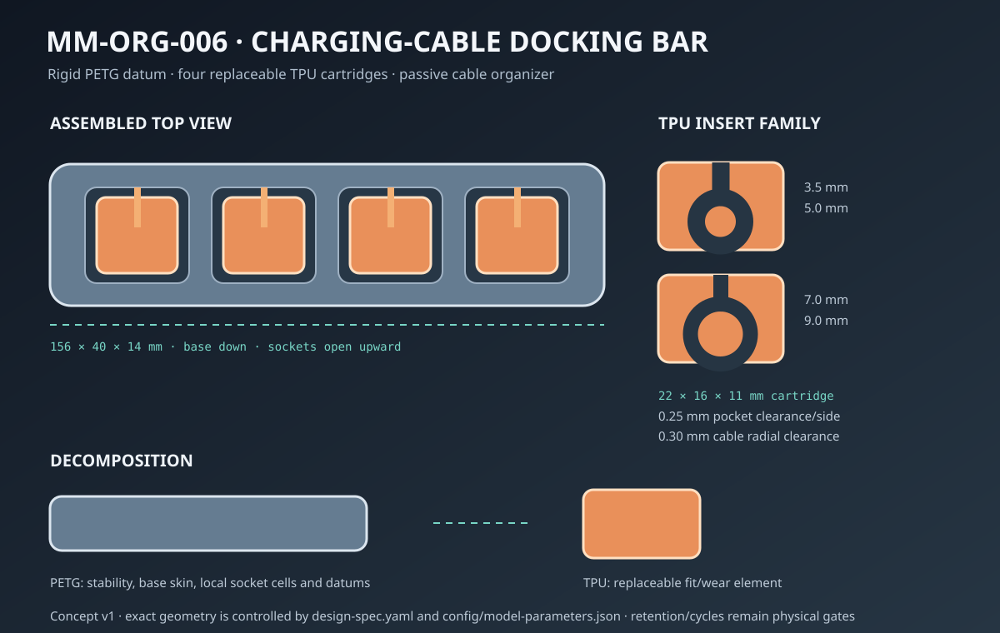
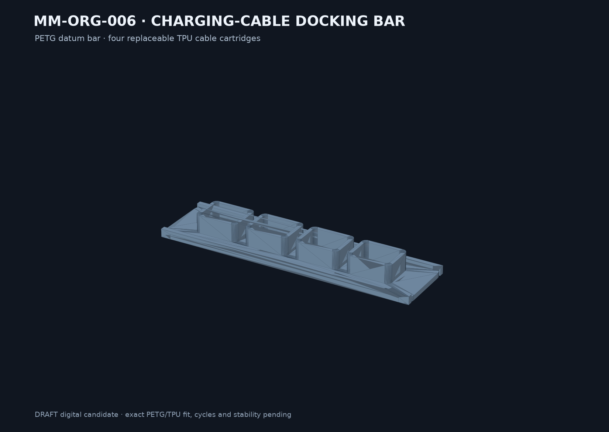

# Final model result — MM-ORG-006

## Result

`SKU-004 Charging-cable docking bar` is implemented as a parametric DRAFT digital candidate. The assembly is 156 × 40 × 14 mm and contains one rigid PETG bar plus four independently replaceable TPU inserts for 3.5, 5.0, 7.0 and 9.0 mm nominal cable diameters.

## Key parameters

- Insert: 22 × 16 × 11 mm plus two 0.20 mm side ribs.
- Pocket: 22.5 × 16.5 mm, 0.25 mm nominal clearance per side and 0.20 mm vertical reserve.
- Cable bore: nominal radius plus 0.30 mm; top entry width is 70% of nominal cable diameter.
- Bar structure: 3 mm continuous base, 5 mm edge beams and four local 27 × 21 mm socket cells.
- Bar candidate CAD volume is about 59.7% below the full-body pocketed baseline; no print-time claim is made.

## Parametric use

The default generator is `cad/build.py`. A custom configuration can be generated with `--bar-length`, `--slot-count`, comma-separated `--diameters` and `--name`; validated limits are 90–180 mm bar length, 2–5 slots and 3–9 mm cable diameter.

## Delivered artifacts

- JSON parameters and editable CadQuery generator
- STEP/STL for the bar and four inserts
- separate PETG socket and TPU 5 mm coupon STLs
- five-object DRAFT 3MF
- concept, decomposition, print guide, physical test plan and digital reports

## Open validation

No exact PETG or TPU slicer profile, G-code, fit force, 100 insert cycles, 500 cable cycles, jacket inspection, one-handed stability, non-slip decision or appearance result exists. The model is a passive organizer only—not a charger, electrical connector, insulation or certified strain relief.
