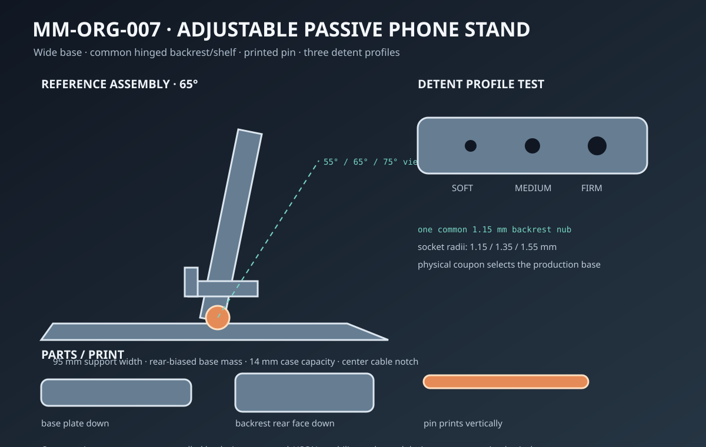
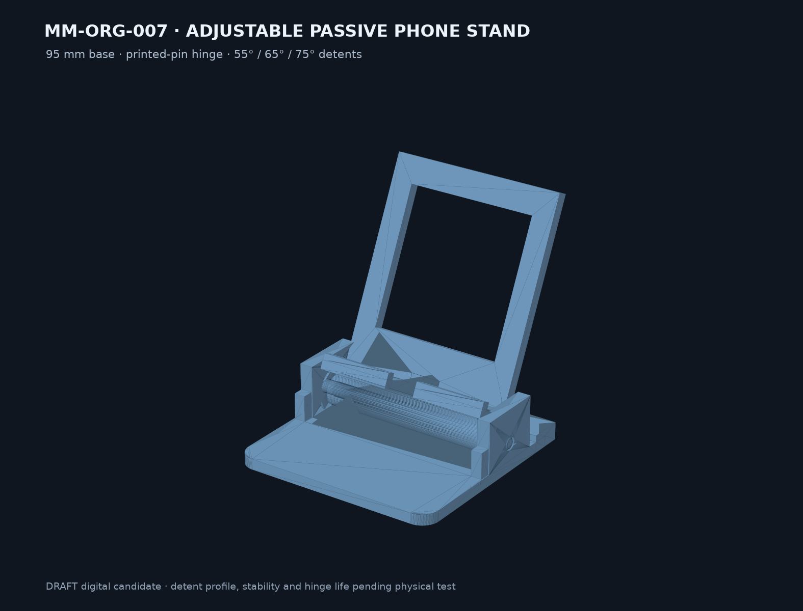

# Final model result — MM-ORG-007

## Result

`SKU-005 Adjustable passive phone stand` is implemented as a fully parametric DRAFT digital candidate. The 65° reference assembly is 95 × 109.72 × 107.32 mm and uses a wide PETG base, serviceable printed pin, windowed backrest, phone shelf, front lip and 14 mm charging-cable notch.

## Key parameters

- Three explicit viewing detents: 55°, 65° and 75° from the base.
- Three alternative base variants: soft, medium and firm detent pockets.
- Hinge: 6 mm pin, 0.25 mm radial clearance and 1.0 mm total axial clearance.
- Device accommodation: 14 mm case target and 350 g future stability target.
- Selected geometry CAD volume is about 80.9% below the solid-wedge baseline; no print-time claim is made.

## Delivered artifacts

- JSON parameters and editable CadQuery generator
- STEP/STL for three bases, common backrest and printed pin
- detent-depth coupon STL
- five-object DRAFT 3MF inventory package
- concept, decomposition, protected-geometry map, print guide, physical test plan and deterministic reports

## Open validation

No exact slicer/G-code evidence, physical detent selection, 500-cycle hinge result, pin-retention result, 350 g portrait/landscape tip-and-slide test, contact inspection or cable-bend result exists. Therefore the model remains a P2 digital candidate and not a released product.
