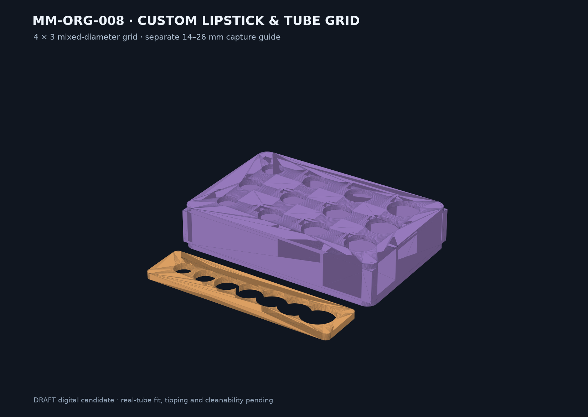

# Final model result — MM-ORG-008

`SKU-006 Custom lipstick and tube grid` is implemented as a parametric DRAFT candidate. The default 161 × 107 × 34 mm grid provides twelve mixed 14–23 mm nominal pockets with 0.5 mm radial clearance. A separate 154 × 38 × 5 mm guide captures 14–26 mm tube diameters before customization.

Delivered: JSON parameters, CadQuery source, grid/guide STEP and STL, two-object 3MF, print guide, protected-geometry map, test plan and deterministic reports. The lattice candidate reduces CAD volume by the value recorded in `reports/optimization-comparison.json` versus a solid bounding block; this is not a mass or print-time claim.

Open: exact slicing/G-code, real circular or tapered tube fit, 100 insertion cycles, loaded tipping, cleanability, edges and appearance. Storage is limited to closed containers; no direct storage of uncontained formulation is claimed.
