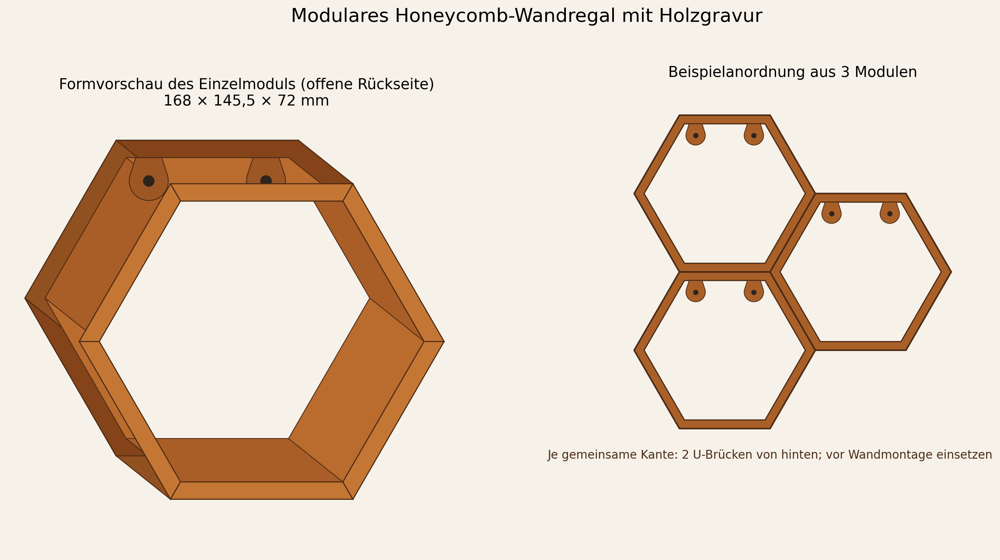

# Modulares Honeycomb-Wandregal mit Holzgravur

Dieses Paket enthält ein druckbares Waben-Regalmodul für kleine 3D-Druckobjekte, universelle Steckclips, Pass- und Texturcoupons, eine editierbare CAD-Basis sowie eine validierte, direkt aus einer 16-Bit-Höhenkarte erzeugte Texturmesh-Pipeline. Die Rückwand ist wahlweise offen oder geschlossen; standardmäßig ist sie offen, damit die Wand hinter dem Regal sichtbar bleibt.



## Ergebnis

| Merkmal | Standardwert |
| --- | ---: |
| Außenmaß | 168 × 145,49 × 72 mm |
| Innenöffnung | ca. 149,52 × 129,49 mm |
| nutzbare Tiefe | 72,0 mm offen / 67,2 mm geschlossen |
| Rahmen / optionale Rückwand | 8,0 / 4,8 mm |
| Befestigungsösen | 2 sichtbare Ösen, 6 mm dick, nahe am oberen Rahmen |
| Holzgravur | max. 0,6 mm tief |
| Produktions-Meshpitch | 0,45 mm |
| Rasterabstand benachbarter Zellen | 145,49 mm |
| Verbindung | 2 U-Brücken pro gemeinsamer Kante, von hinten eingesetzt |
| Wandabstand bei rückseitigen Clips | 2,4 mm mit passenden Distanzscheiben |
| Wandbefestigung | 2 Schrauben pro montierter Zelle |

Die flachen oberen und unteren Hexagonkanten ergeben eine echte Stellfläche. Benachbarte Zellen berühren sich vollflächig an einer Außenkante. Eine U-Brücke wird vor der Wandmontage von hinten über die zusammen 16 mm breite Doppelwand geschoben; zwei Clips pro Kante begrenzen Relativbewegung und Verdrehung. Da die Clips separat sind, kann jede der sechs Seiten eines Moduls später frei verbunden werden.

Die 2,4 mm dicke Clipkappe liegt hinter dem Regal. Bei einer Wandmontage deshalb die mitgelieferten 2,4-mm-Distanzscheiben hinter den beiden Befestigungsösen verwenden. So liegt die Baugruppe plan an, statt nur auf den Clipkappen zu kippeln. Werden keine Clips eingesetzt, können die Distanzscheiben entfallen.

## Offene oder geschlossene Rückseite

Die Auswahl steht in `parameters.json`:

```json
"back_panel_enabled": false
```

- `false` – offene Rückseite mit zwei sichtbaren, zum oberen Rahmen hin ausgesteiften Befestigungsösen; Standard.
- `true` – geschlossene 4,8-mm-Rückwand mit denselben, nach oben versetzten Schraubpositionen.

Nach einer Änderung sowohl `python scripts/generate_textured_mesh.py` als auch `npm run build` im Ordner `cad/` erneut ausführen. Die Ösenpositionen und Abmessungen stehen im Abschnitt `mounting` von `parameters.json`.

## Dateien zum Drucken

- `generated/honeycomb-module-textured.stl` – finale Zelle mit Holzgravur.
- `generated/bridge-clip.stl` – Standardclip mit 0,20 mm Spiel je Seite.
- `generated/rear-wall-spacer.stl` – 2,4-mm-Distanzscheibe für die Wandmontage mit rückseitigen Clips.
- `generated/clip-fit-0p10.stl`, `clip-fit-0p20.stl`, `clip-fit-0p30.stl` – Passproben.
- `generated/wood-texture-coupon.stl` – echte Holzstruktur in der vorgesehenen Tiefe.

Die STEP-Dateien sind die präzisen, untexturierten Konstruktionsmaster. Die dichte Holzstruktur bleibt absichtlich im finalen Mesh; eine Rastertextur als hunderttausende B-Rep-Flächen wäre schwer editierbar und unnötig speicherintensiv.

## Drucken

Das Modul mit dem hinteren Rahmenring und den beiden Ösen flach auf das Bett legen. Für die Standardvariante sind 0,4-mm-Düse, 0,20-mm-Schicht, fünf Wände und PETG angenommen. Die Konstruktion benötigt in dieser Orientierung voraussichtlich keine Stützen. Im Slicer besonders prüfen:

- ob Holzrillen tatsächlich Werkzeugwege erhalten;
- ob die beiden sichtbaren Schraubösen, Schraublöcher und Kopfaufnahmen offen bleiben;
- ob keine dünne Innenwand durch Gap-Fill verschwindet;
- ob Naht und eventuelle Stützen nicht auf Sichtflächen liegen;
- ob das 168 × 145,5 mm große Bettprofil samt Rand wirklich passt.

Die Clips mit der flachen Kappe auf dem Bett und der U-Öffnung nach oben drucken. Erst die drei Passvarianten testen; Maßabweichungen hängen stark von Material, Fluss, Linienbreite und Elephant Foot ab. Distanzscheiben flach drucken.

## Montage mehrerer Zellen

1. Gewünschtes Wabenmuster auf einer ebenen, gepolsterten Fläche auslegen.
2. Berührende Außenflächen vollständig aneinander setzen.
3. Pro gemeinsamer Kante zwei passend kalibrierte U-Brücken von hinten auf die Doppelwand schieben, ungefähr bei einem Drittel und zwei Dritteln der Kantenlänge. Die Kappe liegt anschließend an der Wandseite.
4. Hinter jeder sichtbaren Befestigungsöse eine 2,4-mm-Distanzscheibe einsetzen, sofern rückseitige Clips verwendet werden.
5. Das Raster ausrichten und jede tragende Zelle mit geeigneten Schrauben/Dübeln an der realen Wand befestigen. Schrauben entsprechend dem zusätzlichen Wandabstand ausreichend lang wählen. Die Clips ersetzen keine sichere Wandverankerung.
6. Erst mit nicht wertvollem Ballast stufenweise belasten; anschließend Kriechen über die geplante Einsatzdauer beobachten.

## Holztextur

Innen- und Außenwände verwenden einen durchgehenden Umfangsparameter. Die Bild-X-Richtung läuft entlang der Regaltiefe; dadurch dreht die Maserung nicht auf jeder der sechs Flächen neu. Der Frontring nutzt eine globale XY-Projektion, sodass alle sechs Sektoren dieselbe Vorzugsrichtung behalten. Die Textur fällt an scharfen Kanten auf null ab, damit angrenzende Meshflächen exakt und wasserdicht zusammentreffen.

Hinterer Rahmenring, Ösen, Schraubenauflagen und Clip-Passkanten bleiben glatt. Das erhält Maßhaltigkeit und reduziert Spitzenlasten. Die Holzstruktur ist eine Gravur: Die Außenabmessungen wachsen nicht. Wenn Innen- und Außengravur lokal gleichzeitig die volle Tiefe erreichen, bleiben rechnerisch mindestens 6,8 mm Rahmenstärke vor Drucktoleranzen.

## Parametrisch neu erzeugen

Python-Mesh und Prüfbericht:

```bash
python scripts/generate_textured_mesh.py
python scripts/validate_stl.py generated/honeycomb-module-textured.stl \
  --require-pass --report generated/reimport-textured-validation.json
python scripts/render_preview.py
```

CAD-Basis und Clips als STEP/STL:

```bash
cd cad
npm install
npm run build
```

Alle Nutzerparameter stehen in `parameters.json`. Nicht im Slicer skalieren: Das würde gleichzeitig Wandstärke, Schraubenpassung, Texturtiefe und Clipspiel verändern.

## Sicherheit und Freigabe

Es gibt keine pauschale Lastfreigabe. Wandtyp, Dübel, Schrauben, Randabstände, Druckmaterial, Layerhaftung, Temperatur und Dauerlast bestimmen die reale Tragfähigkeit. Wertvolle oder zerbrechliche Ausstellungsstücke erst nach bestandenem Clip-, Wand-, Proof-Load- und Kriechversuch verwenden. Die verifizierten digitalen Meshprüfungen ersetzen diese physischen Tests nicht.
