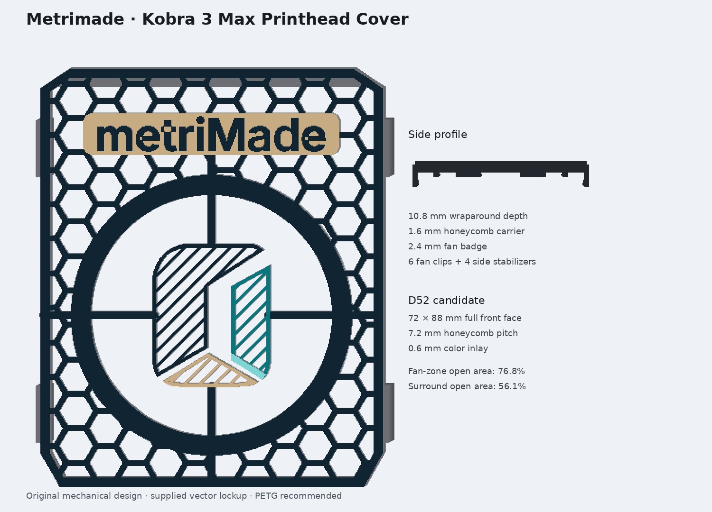

# Anycubic Kobra 3 Max – Metrimade Wraparound Printhead Cover R5

Eigenständiges, leichtes **Vollfront-Cover** für den Druckkopf des Anycubic Kobra 3 Max. Anders als die vorherige flache Blende besitzt R5 eine räumliche, offene Rückseite: einen 4,8-mm-Perimeterrahmen, vier 10,8-mm-tiefe seitliche Stabilisatoren und sechs flexible Lüfterring-Clips. Das Cover liegt als reversibles Add-on vor der Serienfront; es ersetzt weder die werkseitige Frontschale noch den unteren Luftkanal.

Die gesamte 72 × 88-mm-Frontfläche wird von einem groben Wabennetz überspannt. Ausschließlich über dem runden Lüfter sitzt der verstärkte, luftdurchlässige Vierfarb-Metrimade-Einsatz. Der originale `metriMade`-Schriftzug aus der gelieferten SVG liegt oberhalb des Lüfters auf einer geschlossenen sandfarbenen Fläche.

## Zuerst den vollständigen Passrahmen drucken

Anycubic veröffentlicht in den geprüften Unterlagen keine bemaßte Frontschale und keinen exakten Außendurchmesser des erhabenen Lüfterrings. Deshalb liegen drei vollständige Passrahmen bei. Sie prüfen nicht nur den Lüfterring, sondern auch Außenkontur, Abstand zum unteren Luftkanal und vier seitliche Stabilisatoren.

1. Druckkopf ausschalten und vollständig abkühlen lassen.
2. `printhead_cover_fit_frame_D50.stl`, `D52` oder `D54` entsprechend dem gemessenen Lüfterring drucken. D52 ist nur der bildbasierte Startkandidat.
3. Den Rahmen mittig am Lüfterring ansetzen und gleichmäßig aufschieben. Die seitlichen Finger dürfen nur leicht anliegen; bei weiß werdendem PETG, starker Verformung oder Kontakt zum unteren Luftkanal sofort abnehmen.
4. Erst nach erfolgreicher Passprobe das gleich bezeichnete Vollcover drucken.

## Druckdateien

| Datei | Zweck |
|---|---|
| `exports/printhead_cover_metrimade_D50/D52/D54_multicolor.3mf` | Vierfarb-Baugruppe; alle Körper gemeinsam ausgerichtet |
| `exports/printhead_cover_singlecolor_D52.stl` | Einfarbiges Vollcover des bildbasierten Startkandidaten |
| `exports/printhead_cover_fit_frame_D50/D52/D54.stl` | Materialreduzierte vollständige Passrahmen |
| `source/fan_cage_metrimade.scad` | Editierbares parametrisches OpenSCAD-Master |
| `source/generate_fan_cage.py` | Reproduzierbarer Produktionsgenerator |

Die D50-/D52-/D54-Farbkörper stecken vollständig in den jeweiligen 3MF-Dateien. Als einzelne Vollcover-STL wird D52 beigelegt; alle weiteren Einzelkörper und einfarbigen Varianten kann der Generator reproduzierbar erneut erzeugen. Das hält das Paket trotz der fein aufgelösten Wabenmeshes handhabbar.

## Konstruktionsdaten

| Merkmal | Wert |
|---|---:|
| Bildbasiertes Frontmaß | ca. 72 × 88 mm |
| Außenmaß inklusive Stabilisatoren | ca. 74,4 × 88 × 10,8 mm |
| Frontträger / Lüftermodul | 1,6 / 2,4 mm stark |
| Räumlicher Perimeterrahmen | 2,0 mm breit, 4,8 mm tief |
| Seitliche Stabilisierung | vier flexible Finger; 69,0 mm vorläufige Seriengehäusebreite |
| Wabe | Radius 4,2 mm; Teilung ca. 6,3 × 7,3 mm; Rippe 1,2 mm |
| Lüftermodul außen / freie Ringöffnung | 59,2 / 50,8 mm |
| Lüfterring-Kandidaten | 50 / 52 / 54 mm |
| Farbinlay | 0,6 mm bzw. 3 Schichten bei 0,2 mm |
| M-Bildmarke | 30 mm hoch; 0,8-mm-Kontur plus 0,8-mm-Lamellen |
| Schriftzugfläche | 48-mm-Wortbreite auf 54 × 8,8 mm |
| Projizierter offener Anteil in Ø40 mm | ca. 76,8 % |
| Projizierter offener Anteil im Wabenumfeld | ca. 56,2 % |
| Geschätzte PETG-Masse D52 | ca. 12,3 g |

Die Öffnungswerte sind 2D-Geometriekennzahlen und keine Luftstrom- oder Temperaturmessung.

## Druckprofil

- PETG empfohlen; gleiche Polymerfamilie für alle Farben.
- 0,4-mm-Düse, 0,20-mm-Schichthöhe, etwa 0,42–0,46 mm Linienbreite.
- Sichtbare Logo-Seite (`z=0`) flach auf eine glatte Druckplatte; Schale und Clips zeigen nach oben. Keine Supports vorgesehen.
- Dünnwand-/Arachne-Erkennung aktivieren, erste Schicht langsam, kein Ironing.
- Die vier 3MF-Körper als ein zusammengesetztes Objekt behandeln und ACE-Slots in Anycubic Slicer Next manuell zuweisen.
- SVG-Farben: Navy `#112431`, Teal `#08777D`, Aqua `#7FD5D3`, Sand `#C7AB82`.

## Montage- und Betriebsprüfung

1. Cover nur am verstärkten Lüfterring halten und gleichmäßig montieren; nicht am Wabenrand hebeln.
2. Prüfen, dass der umlaufende Rahmen die Serienfront nicht aufdrückt und der untere abnehmbare Luftkanal vollständig frei bleibt.
3. Seitliche Stabilisatoren dürfen nicht gegen Kabel, Schalter oder bewegliche Teile drücken. Sie sind sekundäre Anti-Rotationspunkte; der Lüfterring ist das primäre Datum.
4. Lüfter bei 25 %, 50 % und 100 % prüfen. Bei Schleifen, Pfeifen, Vibration oder auffälliger Temperatur das Cover abnehmen.
5. Erst danach einen kurzen Druck und einen Kamera-Clip testen.

## Recherche und Eigenständigkeit

- Die offizielle Anycubic-Anleitung zum Druckkopf-Kühlventilator zeigt Frontschale, zentralen Lüfter, zwei rückseitige Schrauben und das seitliche Zusammendrücken beim Abnehmen.
- Die offizielle Anleitung zum Modellkühlventilator bestätigt den unteren Luftkanal als freizuhaltendes separates Bauteil.
- Frontproportionen wurden mit dem dokumentierten 50-mm-Lüfter als Bildmaßstab abgeschätzt und auf eine unabhängige 72 × 88-mm-Hülle gerundet.
- Community-Beispiele wurden nur visuell auf Schalenform, seitliche Stabilisierung und Montageprinzipien geprüft. Keine fremde STL-, STEP-, 3MF- oder CAD-Geometrie wurde heruntergeladen, importiert oder nachgezeichnet.
- Hersteller- und Community-Bilder sind nicht Bestandteil des verteilbaren ZIP-Pakets.
- Das gelieferte Metrimade-SVG ist die alleinige Quelle für Logo, Schriftzug und Farben.

R5 ist ein digital geprüfter, druckbarer Prototyp. Reale Passung, Freigängigkeit, thermisches Verhalten, Luftstrom, Kameralesbarkeit und Filamentfarbwirkung bleiben physische Freigaben des Nutzers.
