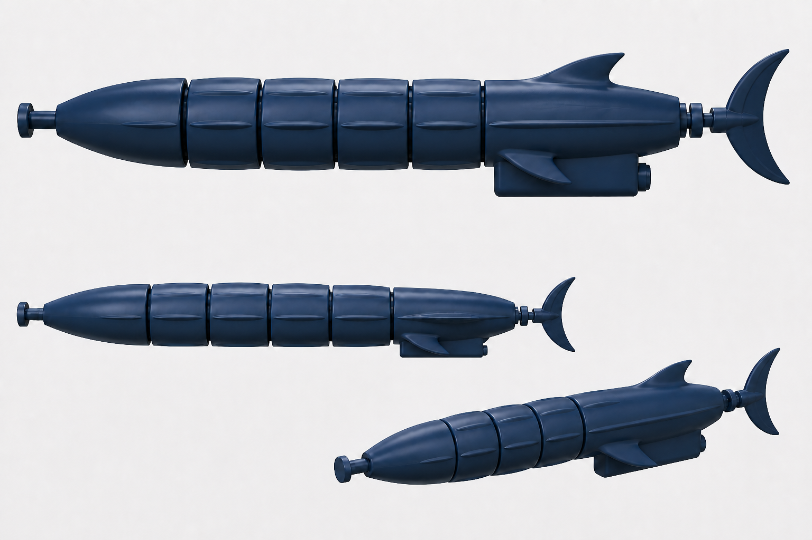

# MM-BOAT-003 fish-silhouette concept review

## Approval target

- Specification: `design-spec.yaml`, revision `1.1.0-draft.1`
- Concept asset: `previews/concept-fish-silhouette-v1.1.0-draft.1.png`
- SHA-256: `bb6d382716ed4a60a83ae6ae29706fc5c98b8d2c87d9762e6cb5011720246323`
- Status: approved by Stefan in chat on 2026-08-28

## Requirement-to-feature correspondence

| Approved requirement | Visible concept feature |
|---|---|
| Clearly fish-shaped, streamlined body | One fair side/top silhouette from the tapered nose through the long rear capsule |
| Preserve the articulated architecture | One nose, exactly four short body modules, one long capsule, and visible narrow joint cuts |
| Replace rod-like ribs | Broad shallow longitudinal crests blended into the shell |
| Add restrained fish fins | One swept dorsal fin and one bilateral swept pectoral-fin pair on the capsule |
| Make the tail read as a fish tail | Vertically symmetric rounded crescent caudal fin on a narrow mechanical root |
| Keep the submarine technical | Single-color CAD/PETG language with exposed joints, ballast keel, piston knob and tail-drive transition |
| Avoid comic/animal decoration | No eyes, mouth, gills, scales or skin texture |

## Dimensional and functional context

The image is not dimensional evidence. The current assembled baseline is about
`413.2 x 48.56 x 86.13 mm`; the revised exact envelope will be derived in CAD.
The following remain authoritative and unchanged unless deterministic checks
justify an approved revision:

- five vertical hinge axes and `4.5 mm` hinge bores;
- `±10°` articulation per joint;
- bladder piston bore, travel and knob access;
- bayonet cap, O-ring glands, motor/battery/ballast interiors and keel plug;
- crank/rocker sweep and existing tail-fin tang/pin interface;
- `0.10 mm` maximum hardpoint drift and `2.4 mm` minimum visible-fin thickness.

## Deliberate visual simplifications

- The tail-drive rings are a visual placeholder, not the exact slotted-rocker
  mechanism.
- Hinge ears and pins are represented by dark joint cuts rather than exact
  hardware.
- The keel and pectoral-fin overlap is shown for silhouette judgment; CAD must
  resolve their actual root, print orientation and motion/service keep-outs.
- Highlight flow communicates the intended fair envelope but is not G2 or
  curvature-measurement evidence.

## Generation record

- Mode: built-in `image_gen`
- Reference role: existing side, top and perspective CAD previews supplied the
  architecture and proportions only.
- Final prompt intent: preserve the nose, four articulated modules, long rear
  capsule, keel and flapping-tail architecture; replace cylindrical drum
  styling with a continuous freeform fish silhouette, three broad shallow
  crests, capsule-mounted swept fins and a symmetric caudal tail; keep a clean
  navy CAD concept-sheet presentation without labels or animal decoration.

Production CAD is authorized for specification revision `1.1.0-draft.1`.
Watermark, physical, appearance and final-release approvals remain separate.
