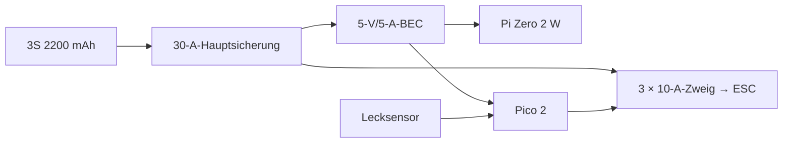
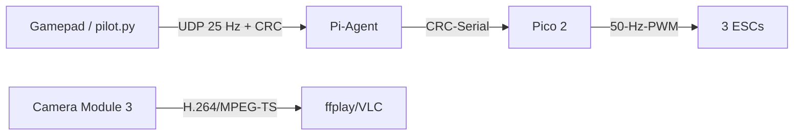

# Deep Research und Entwurfsbegründung

## Ergebnis in einem Satz

Der sinnvollste budgetorientierte Aufbau ist kein funkgesteuertes Mini-U-Boot,
sondern ein **kleiner tethered ROV mit drei Thrusters**, passiv stabilisiertem
Rohrrahmen, geprüftem COTS-Druckkörper und offener Pi/Pico-Software. Damit bleiben
die schwierigen Funktionen – Druckdichtheit, Kabelabdichtung und Propeller – bei
bewährten Kaufteilen, während 3D-Druck alle fahrzeugspezifischen Schnittstellen
übernimmt.

## 1. Randbedingungen und bewusste Nicht-Ziele

- etwa 320 × 240 × 180 mm, transportabel in einer Kiste;
- manuell steuerbar: Vor/Zurück, Gieren, Auf/Ab;
- zunächst 0,5–1 m in klarem Süßwasser, nach gestufter Validierung höchstens 3 m;
- 5–10 m Daten-Tether, Energie an Bord;
- keine Personen im Becken, kein autonomer Betrieb, keine zertifizierte
  Spielzeugsicherheit, keine Salzwasserfreigabe und keine Druckfreigabe aus CAD;
- keine gedruckte Druckhülle und keine gedruckten Propeller.

Der Begriff „Spielzeuggröße“ beschreibt hier die Geometrie. LiPo, schnell
rotierende Propeller und eine Druckhülle machen das Gerät zu einem beaufsichtigten
Maker-Prototyp.

## 2. Was bestehende Projekte zeigen

### SeaPerch

[SeaPerch](https://seaperch.org/page-resources/resource-activity-guide/) zeigt,
dass ein offener, leicht veränderbarer Rahmen und drei Motoren für Lern-ROVs
genügen. Der pädagogisch wichtigste Punkt ist nicht Autonomie, sondern ein
systematischer Test von Auftrieb, Manövrierbarkeit und neutraler/leicht positiver
Trimmung. Übernommen werden Einfachheit, Reparierbarkeit und Testreihen; nicht
übernommen wird die grobe PVC-/Handschalter-Architektur.

### OpenROV und das 2017er 3D-Druckprojekt

[OpenROV-Hardware](https://github.com/OpenROV/openrov-hardware) und
[OpenROV-Software](https://github.com/OpenROV/openrov-software) etablierten
offene CAD-/Software-Pfade und Tether-Video, sind heute aber eher historische
Referenzen. Das [customisable underwater robot](https://github.com/guidoschillaci/underwater-drone)
von Schillaci et al. ist besonders relevant: 4″-Blue-Robotics-WTE, geflutete
Turnigy-Outrunner, austauschbare Klemmen, Adapter und Ballast. Seine Empfehlung
„solid infill“ wird verbessert: lastorientierte Schalen, kurze Rippen und lokale
Aufdopplungen drucken schneller und vorhersehbarer als massive Blöcke.

### MUR

Der 2025 veröffentlichte [Miniature Underwater Robot](https://github.com/scottmayberry/MUR)
ist ein wertvoller moderner Referenzpunkt für Lecksensoren, Drucksensoren,
Not-Aus, PID und modulare Software. Seine dokumentierten Kosten liegen jedoch
bei US$858,69 selbstgedruckt bzw. US$1.878,69 mit T200; zudem nutzt er ROS 1. Für
einen Spielzeuggrößen-ROV wären Sensorpaket und ROS-Stack unnötiger Ballast.
Übernommen werden Failsafes und Upgrade-Schnittstellen, nicht die Vollausstattung.

### BlueROV2, BlueOS und ArduSub

Der [BlueROV2](https://bluerobotics.com/store/rov/bluerov2/) ist die reife,
aber deutlich teurere Referenz. Entscheidend ist der Softwarepfad:
[ArduSub](https://ardupilot.org/sub/) unterstützt offiziell eine
[SimpleROV-3-Konfiguration](https://ardupilot.org/sub/docs/sub-frames.html) mit
genau zwei horizontalen und einem vertikalen Thruster (`FRAME_TYPE=4`). Sie kann
Gieren, Tiefe und Vorwärtsbewegung steuern und verlässt sich für Roll/Pitch auf
korrekten Schwerpunkt und Ballast. Damit ist die gewählte Mechanik später ohne
Rahmenumbau auf [BlueOS](https://blueos.cloud/docs/stable/usage/overview/) und
[Cockpit](https://blueos.cloud/cockpit/docs/stable/usage/overview/) migrierbar.

## 3. Warum Tether statt Unterwasserfunk

Blue Robotics fasst den Branchenstandard klar zusammen: Fast alle ROVs haben
einen Tether; moderne Funkwellen reichen unter Wasser nicht weit genug
([„What is an ROV?“](https://bluerobotics.com/learn/what-is-an-rov/)). Darum gilt:

- kein 2,4-GHz-WLAN, Bluetooth oder ELRS im getauchten ROV als Primärlink;
- 100BASE-TX über Cat5e für 5–10 m Poolbetrieb: billig, mehr als genug Bandbreite;
- bei längerem, dünnem Tether ein Single-Pair-Modem wie Fathom-X; Blue-Robotics-
  Support nennt direkte Cat5-Verbindungen als sinnvollen kurzen Pfad und Modems
  ab ungefähr 30–50 m
  ([Diskussion](https://discuss.bluerobotics.com/t/help-needed-building-a-wireless-remote-controlled-underwater-rov/20420));
- optional WLAN/ELRS in einer Oberflächenboje, niemals als getauchte Antenne.

Der v0.1-Tether transportiert **nur Daten**. Das vermeidet hohe Ströme,
Spannungsabfall und ein dickes Leistungskabel. Nachteil ist der Akku im WTE;
deshalb ist die Mission kurz und der Akku wird nur außerhalb der geschlossenen
Hülle geladen.

## 4. Mechanische Architektur

### Koordinaten und Anordnung

- X: vorwärts, Y: Steuerbord, Z: oben;
- 2 × 300-mm-Längsrohr bei Y ≈ ±95 mm;
- 2 × 190-mm-Querrohr bei X ≈ ±110 mm;
- 75-mm-WTE längs zentral und über dem Rahmen;
- Horizontal-Thruster hinten links/rechts, Achsen parallel X;
- Vertikal-Thruster hinten zentral, freie Strömung hinter dem WTE;
- Schaum oben, Akku und verstellbarer Edelstahlballast möglichst tief;
- Tether-Zugentlastung am Rahmen vor der Kabeldurchführung.

Die vier Rohrknoten bestehen jeweils aus zwei identischen Sätteln, die um 90°
gegeneinander verschraubt und mit je zwei Kabelbindern gesichert werden. Dadurch
entfallen große Sonderklemmen. TPU-/EPDM-Streifen verteilen die Klemmung und
isolieren Metall/CFK.

### Warum 75 mm statt 50 mm WTE

In 50 mm passen Pi Zero und kleine Batterie einzeln, aber nicht sauber zusammen
mit drei innenliegenden ESCs, Sicherungsverteilung, BEC und servicefähiger
Verkabelung. 75 mm ist noch spielzeugnah, senkt jedoch Montagefehler und erlaubt
einen 62×220-mm-Schlitten. Das Druckgehäuse wird nach
[WTE-Handbuch](https://bluerobotics.com/learn/watertight-enclosure-wte-assembly-new/)
montiert: O-Ringe kontrollieren, nur dünn geeignetes Silikonfett, keine harten
O-Ring-Werkzeuge, keine ungeeignete Schraubensicherung an Acryl und PRV/Vent
verwenden. Das schwächste konfigurierte WTE-Teil bestimmt die zulässige Tiefe.

Die gedruckten WTE-Sättel **tragen**, sie **dichten nicht**. Flansche dürfen nicht
frei auskragen. Vier Penetratoren sind vorgesehen: drei normale WetLinks für die
Motorkabel und ein [WetLink JPT](https://bluerobotics.com/store/cables-connectors/penetrators/wetlink-penetrator-jpt/)
für den durchgehenden Ethernet-Tethermantel. WetLink-Daten gelten nur für
abgestimmte Kabeldurchmesser und validierte Kabelkonstruktionen.

### CFK, GFK und Korrosion

10×8-mm-CFK-Rohr ist im Flug-/Drohnenmarkt leicht, steif und aktuell für etwa
€14,80/m verfügbar. CFK ist leitfähig und in Kontakt mit Metall galvanisch
problematisch. Deshalb:

1. nass sägen/absaugen, Kanten brechen, Enden mit Epoxid schließen;
2. A4-Schrauben und Aluminium elektrisch mit TPU/EPDM isolieren;
3. nach Süßwasser abspülen und trocknen;
4. für regelmäßiges Salzwasser gleich dimensioniertes GFK-Rohr bevorzugen.

## 5. Propulsion aus dem RC-/Drohnenmarkt

Ein normaler Flug-Outrunner kann geflutet laufen, doch Lager, Wicklungsbeschichtung
und Korrosion sind unbekannt. Primär gewählt ist deshalb ein ausdrücklich als
Unterwassermotor angebotener 2828/500-KV-Outrunner. Seine 100-m-Angabe ist eine
**Herstellerbehauptung, keine Freigabe dieses ROVs**. Der separate reversible
PWM-ESC bleibt trocken; sein IPX6 reicht nicht für Außenmontage.

Der gedruckte Thruster besteht aus:

- 78-mm-Außenring, 68-mm-Strömungsbohrung;
- COTS-Propeller 60 mm → nominal 4 mm radialer Freiraum;
- rückseitigem Spider und austauschbarer geschlitzter Motoradapterplatte;
- separatem Frontgitter mit 5,1-mm-Quadratöffnung;
- vier M3-Servicepunkten und Schieberingen zum 10-mm-Rohr.

Die Adapterlöcher sind bewusst nur Startgeometrie. Vor dem Vollsatz werden ein
Motor, ein Propeller und ein Adapter gekauft, vermessen und als Einzelmodul bei
20/35/50 % getestet. v0.1 begrenzt Softwareleistung zunächst auf 35 %. Schub,
Strom und Motortemperatur werden nicht aus Marketingdaten abgeleitet.

## 6. Elektrik und Leistung

Die 10-A-Zweigsicherungen sind ein Startwert auf Basis der kleinen Motorgröße,
nicht die finale Dimensionierung. Der Tanktest liefert den gemessenen
Blockier-/Volllaststrom; Leitungen und Sicherungen werden danach festgelegt.
Der ESC darf mehr Strom können als Motor und Zweig – die Sicherung schützt
Leitung und Fehlerfall.

Laufzeit wird nur als Planungsbereich angegeben:

\[
t_\mathrm{min}=60\cdot\frac{0{,}8\,C_\mathrm{Ah}}{I_\mathrm{avg}}
\]

Bei 2,2 Ah und später gemessenen 4–6 A Missionsmittel wären das grob 18–26 min.
Bis zur Messung wird mit **15–25 min** geplant. Der Pico misst die Akkuspannung
über 100-kΩ/33-kΩ-Teiler und meldet sie; das ersetzt weder Zellprüfung noch
Balancer-Lader. Ein Akku wird nie im geschlossenen WTE geladen.

## 7. Steuerungs- und Videostack

### Datenweg

- Topside: `pilot.py`, Pygame, Totmann-Arming, Tastaturfallback;
- Pi: Paket-Reihenfolge/CRC, 1,5 s Neutral-Arming, 300-ms-Watchdog, Telemetrie;
- Pico: 2,5 s ESC-Neutral beim Boot, eigener 300-ms-Watchdog, Leck-Hardstop,
  1000–2000 µs PWM mit 1500 µs Neutral;
- Mischer: `links = surge + yaw`, `rechts = surge - yaw`, `vertikal = heave`,
  anschließend normiert;
- Video: offizielles `rpicam-vid` über TCP/MPEG-TS. Raspberry Pi dokumentiert
  sowohl TCP- als auch UDP-Streaming und Low-Latency-`ffplay`
  ([Kamera-Dokumentation](https://www.raspberrypi.com/documentation/computers/camera_software.html#stream-video-over-a-network-with-rpicam-apps)).

Zwei getrennte Watchdogs sind absichtlich redundant. Ein eingefrorener Laptop,
ein abgezogenes Ethernetkabel, ein gestoppter Pi-Prozess oder eine gestörte
USB-Serial-Verbindung führt innerhalb höchstens etwa 300 ms zu 1500 µs Neutral.
Das muss ohne Propeller am Oszilloskop/Servotester nachgewiesen werden.

### ArduSub-Ausbaupfad

Für Depth-/Heading-Hold werden später ein Drucksensor (z. B. Bar02 für flaches
Wasser), IMU und ein von BlueOS offiziell unterstützter Flight Controller ergänzt.
Die [BlueOS-Hardwareliste](https://blueos.cloud/docs/stable/integrations/hardware/required/flight-controller/)
sollte maßgeblich sein; billige ArduPilot-Klone werden nicht stillschweigend als
getestet angenommen. Rahmenparameter: `FRAME_TYPE=4` / SimpleROV-3. Erst nach
manueller Stabilität wird ein PID aktiviert.

## 8. FDM-Entwurf nach Lastpfaden

Empfohlener Startprozess:

| Parameter | Startwert |
|---|---:|
| Material | PETG; ASA nur mit beherrschter Kammer/Haftung |
| Düse / Schichthöhe | 0,6 / 0,30 mm |
| Linienbreite | 0,68 mm |
| Funktionswände | 4 Pfade, nominal ca. 2,53 mm |
| Rippen/Stege | 3 Pfade, nominal ca. 1,91 mm |
| Boden/Deckel | 5 Schichten, nominal 1,50 mm |
| Infill | 15–25 % nur wo ein echter Kern existiert |
| Geschwindigkeit | 45 mm/s als konservativer Start |

Die Werte stammen aus `config/fdm_plan.json`. Bei 4-mm-Platten verbrauchen die
gegenüberliegenden Vier-Pfad-Wände rechnerisch den gesamten Querschnitt; dort
ändert ein Infill-Prozentwert wenig. Exakte Wandpfade, Gap-Fill und Druckzeit
müssen im tatsächlich verwendeten Slicer geprüft werden. Ohne installierten
Produktionsslicer werden **keine erfundenen Druckzeiten oder Grammwerte** genannt.
Das Mesh-Manifest enthält stattdessen geschlossenes CAD-Volumen und eine
Vollmaterial-Obergrenze.

Orientierung:

- Sättel, Guard und Adapter flach auf ihrer größten Ebene;
- Nozzle mit Achse Z, Spider auf dem Druckbett;
- Kamera-L-Winkel auf die Seite;
- WTE-Sattel mit flacher Unterseite;
- keine Supports in Strömungskanälen; Brim nur wo nötig.

Nach fünf Nass-/Trockenzyklen wird je ein Probesattel auf Risse, Kriechen und
Kabelbinderspannung geprüft. 3D-Druckteile sind Verschleiß-/Servicekomponenten,
nicht Druckbarrieren.

## 9. Auftrieb, Schwerpunkt und Trimmung

Nicht aus CAD raten: Das komplett montierte, trockene ROV wird gewogen und sein
Verdrängungsvolumen per Eintauch-/Waagentest bestimmt. In Süßwasser gilt näherungsweise
1 cm³ geschlossener Schaum ≈ 1 g Auftrieb, abzüglich Schaummasse.

Ziel:

- 20–40 g positive Restauftriebskraft: bei Stromausfall steigt das ROV langsam;
- Auftriebszentrum mindestens sichtbar oberhalb des Schwerpunkts, Startziel
  30–50 mm Abstand;
- Roll-/Pitch-Trimmung über obere Schaumblöcke und unteren Edelstahlballast;
- keine Bleikugeln in gedruckten Hohlräumen; bevorzugt verschraubte/gesicherte
  Edelstahlplatten, damit Masse exakt und rückholbar verändert wird.

## 10. Evidenzgrenzen

| Aussage | Status |
|---|---|
| Tether ist der zuverlässige Primärlink | durch etablierte ROV-Praxis und Quellen gestützt |
| SimpleROV-3 ist in ArduSub vorhanden | offizielle Dokumentation |
| Pi Zero 2 W kann 1080p30 H.264 enkodieren | offizielle Produktspezifikation |
| APISQUEEN-Motor ist 100 m wasserdicht | nur Herstellerangabe; nicht als Systemfreigabe verwendet |
| 4-mm-Propellerfreiraum und 5,1-mm-Gitter | CAD-Maß; reale Teile nachmessen |
| 15–25 min Laufzeit | Planungsbereich; Strommessung ausstehend |
| 3 m Einsatz | erst nach Vakuum-, Leck-, Trim- und Stufentests; keine aktuelle Freigabe |
| Druckteile tragen die Struktur | Mesh-Topologie geprüft; reale FDM-/Nasszyklusprüfung ausstehend |

Die offenen Punkte sind absichtlich als Testgates formuliert. Ein erfolgreich
generiertes STL oder ein Hersteller-Tiefenwert ersetzt keine Baugruppenprüfung.
