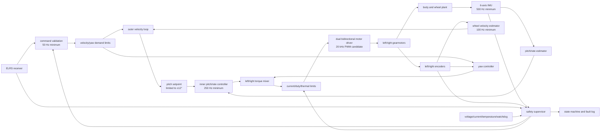

# Control architecture — MM-TOY-003 v0.1.0

Status: decomposition candidate; not qualified firmware or physical safety evidence

## Boundary

The rover is an unstable inverted pendulum. Loss of torque, stale data, an
incorrect axis sign or a control overrun can cause immediate motion. This
architecture therefore separates remote commands from stabilization and places
a safety supervisor around every torque request. It does not authorize free
balancing or establish a safety claim.

The remote transmitter requests bounded speed, yaw and state changes. It never
commands motor PWM directly. Loss of the FPV link has no authority over motion;
loss of the control link commands zero speed and yaw while the balance loop is
still healthy, then tip detection handles the subsequent landing.

## Signal and control flow



For the provisional sign convention, positive `X` is forward, positive pitch
is nose-up and positive yaw is left. The exact left/right motor and encoder
signs must be discovered with wheels off the ground and stored in a versioned
configuration. The mixer signs are not frozen until that test passes.

## Deterministic rates and budgets

| Function | Minimum rate | Provisional implementation rule |
|---|---:|---|
| IMU acquisition | 500 Hz | SPI with data-ready timestamp; reject stale, duplicated or invalid samples |
| Pitch/rate estimator and inner controller | 250 Hz | fixed 4 ms task; deadline miss enters a latched fault after the approved threshold |
| Wheel velocity estimator and outer loop | 100 Hz | use both quadrature encoders and a low-speed estimator that cannot divide by zero |
| Command and failsafe processing | 50 Hz | validate range, age, arm state and link health before accepting a setpoint |
| Driver PWM | 20 kHz candidate | sign-magnitude or locked-antiphase only after driver bench verification |
| Logging | at least 100 Hz for core channels | timestamp pitch, rate, wheel speeds, setpoints, output limits, voltage, currents and fault bits |

IMU sampling may run at 1 kHz during characterization, but the approved minima
remain the release requirements. Loop timing and sample age are first-class
logged values, not inferred from configured timer rates.

## Controller decomposition

1. Calibrate stationary gyro bias and verify gravity direction while motors are
   inhibited.
2. Fuse gyro and accelerometer into pitch/rate. A complementary filter or a
   documented state estimator may be used; tuning and latency must be identified
   from logged data.
3. Convert bounded forward speed into a bounded pitch setpoint. Integrator state
   must be reset or tracked across disarm and saturation.
4. Compute common balance torque from pitch error and pitch rate.
5. Compute differential yaw torque from bounded yaw demand and wheel motion.
6. Mix common and differential torque into left/right requests, apply a shared
   saturation strategy and preserve balance authority ahead of yaw authority.
7. Convert torque requests into characterized duty/current limits. Until motor
   and driver identification exists, this conversion is only a provisional
   duty command.

The 12-degree normal pitch limit, 5-degree arm-capture angle and 35-degree tip
threshold are configuration values from `design-spec.yaml`, not proven physical
limits. The tip threshold requires 150 ms confirmation unless another fault
requires immediate motor inhibition.

## State machine

```mermaid
stateDiagram-v2
    [*] --> DISARMED
    DISARMED --> CALIBRATING: deliberate arm request + near upright
    CALIBRATING --> READY: sensor bias and health checks pass
    CALIBRATING --> FAULT: timeout or invalid sensor
    READY --> BALANCING: deliberate enable + capture angle pass
    BALANCING --> DISARMED: deliberate disarm
    BALANCING --> FAULT: stale data / deadline / power / current / thermal fault
    BALANCING --> TIPPED: tilt above threshold for confirmation time
    READY --> FAULT: health check fails
    FAULT --> DISARMED: power-cycle or explicit cleared-fault procedure
    TIPPED --> DISARMED: motors inhibited and body settled
    DISARMED --> CALIBRATING: new deliberate arm; no automatic re-arm
```

Motor output is zero in `DISARMED`, `CALIBRATING`, `FAULT` and `TIPPED`.
`READY` may only perform non-torque diagnostics. Re-arm always requires a fresh
operator action and a repeated near-upright health check.

## Safety supervisor inputs and responses

| Condition | Required response |
|---|---|
| IMU sample stale, corrupt or implausible | inhibit motor output and latch fault |
| Encoder stale or impossible while torque is requested | inhibit output or enter the approved bounded landing response; latch diagnostic |
| Control deadline/watchdog failure | hardware watchdog and motor-enable path remove torque |
| RC loss | command zero speed and yaw; retain balance only while every local health condition passes |
| FPV loss | no direct control action; operator retains line-of-sight and commands stop |
| Excess tilt | inhibit torque after qualified threshold/confirmation; require deliberate re-arm |
| Undervoltage or logic brownout risk | bounded stop where physically possible, then inhibit; never reboot into an armed state |
| Overcurrent or driver overtemperature | immediate channel limiting/inhibition according to qualified thresholds; latch fault |
| Sensor-axis or motor-sign mismatch | wheels-off-ground test fails; free-balance gate remains blocked |

The Cytron MDD10A candidate does not provide the current telemetry and fault
reporting required by the specification. It is acceptable only if qualified
external per-channel current sensing, voltage measurement, temperature
observation and a fail-safe motor-enable path are added and tested. Otherwise a
different driver must be selected. A fuse is fault-energy protection, not a
closed-loop current controller.

Regenerative braking and emergency disconnect require a power-system decision:
opening the battery path while energy is returning from the motors can create a
destructive bus transient. No disconnect topology or powered test is approved
until `DEC-POWER-001` is closed.

## Model and test ladder

The first model shall include body mass and pitch inertia, center-of-mass height,
wheel radius/inertia, gearbox ratio, motor electrical dynamics, driver voltage
limits, Coulomb/viscous loss, command delay, sensor noise/bias, sample timing and
output saturation. Ideal torque sources are insufficient for candidate tuning.

Validation order is fail-closed:

1. Static firmware tests and recorded sign/unit checks.
2. Deterministic plant simulation with delay, saturation and injected faults.
3. Hardware-in-the-loop sensor, encoder, RC and watchdog fault injection.
4. Wheels off ground with motor power/current bounded.
5. Mechanically restrained pendulum with a reachable external power cut.
6. Tethered low-energy balance in a clear exclusion zone.
7. Supervised free balance, then low-speed drive and yaw tests.

Advancing a stage requires human review of the previous stage's logs and
hardware condition. The controller, parameters and log schema must carry one
version identifier so a physical result is traceable to exact code and settings.
