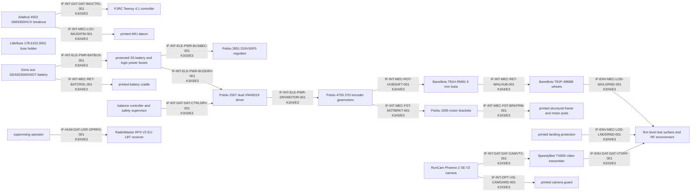

# Interface graph — MM-TOY-003 / 0.1.0-bom.2

Status: `CANDIDATE_UNMEASURED`; authority: `preflight/preflight-result.json`.

## Interface register

| ID | A → B | Domains | K/IC/E | Verification |
|---|---|---|---|---|
| `IF-INT-MEC-FST-MOTBRKT-001` | Pololu 4755 37D encoder gearmotors → Pololu 1995 motor brackets | GEO, MEC | K3/I3/E3 | PLANNED |
| `IF-INT-MEC-FST-BRKFRM-001` | Pololu 1995 motor brackets → printed structural frame and motor pods | GEO, MEC | K3/I3/E3 | PLANNED |
| `IF-INT-MEC-ROT-HUBSHFT-001` | Pololu 4755 37D encoder gearmotors → BaneBots T81H-RM61 6 mm hubs | GEO, MEC, KIN | K3/I4/E3 | PLANNED |
| `IF-INT-MEC-RET-WHLHUB-001` | BaneBots T81H-RM61 6 mm hubs → BaneBots T81P-496BB wheels | GEO, MEC, KIN | K3/I4/E3 | PLANNED |
| `IF-ENV-MEC-LOD-WHLGRND-001` | BaneBots T81P-496BB wheels → firm level test surface and RF environment | MEC, KIN, ENV | K3/I4/E3 | PLANNED |
| `IF-INT-MEC-RET-BATCRDL-001` | Gens ace GEA503S60X6GT battery → printed battery cradle | GEO, MEC, ELE | K3/I4/E3 | PLANNED |
| `IF-INT-ELE-PWR-BATBUS-001` | Gens ace GEA503S60X6GT battery → protected 3S battery and logic power buses | ELE, THM, MEC | K3/I4/E3 | PLANNED |
| `IF-INT-ELE-PWR-BUSDRV-001` | protected 3S battery and logic power buses → Pololu 2507 dual VNH5019 driver | ELE, THM | K3/I3/E3 | PLANNED |
| `IF-INT-ELE-PWR-BUSBEC-001` | protected 3S battery and logic power buses → Pololu 2851 D24V50F5 regulator | ELE, THM | K3/I3/E3 | PLANNED |
| `IF-INT-ELE-PWR-DRVMOTOR-001` | Pololu 2507 dual VNH5019 driver → Pololu 4755 37D encoder gearmotors | ELE, MEC, THM | K3/I4/E3 | PLANNED |
| `IF-INT-MEC-LOC-IMUDATM-001` | Adafruit 4502 ISM330DHCX breakout → printed IMU datum | GEO, MEC, KIN | K3/I4/E3 | PLANNED |
| `IF-INT-DAT-DAT-IMUCTRL-001` | Adafruit 4502 ISM330DHCX breakout → PJRC Teensy 4.1 controller | DAT, ELE | K3/I3/E3 | PLANNED |
| `IF-INT-DAT-DAT-CTRLDRV-001` | balance controller and safety supervisor → Pololu 2507 dual VNH5019 driver | DAT, ELE | K3/I3/E3 | PLANNED |
| `IF-HUM-DAT-USR-OPRRX-001` | supervising operator → RadioMaster RP3 V2 EU-LBT receiver | HUM, DAT, ENV | K3/I4/E3 | PLANNED |
| `IF-INT-OPT-VIS-CAMGARD-001` | RunCam Phoenix 2 SE V2 camera → printed camera guard | OPT, GEO, MEC | K2/I3/E3 | PLANNED |
| `IF-INT-DAT-DAT-CAMVTX-001` | RunCam Phoenix 2 SE V2 camera → SpeedyBee TX800 video transmitter | DAT, ELE, THM | K2/I3/E3 | PLANNED |
| `IF-ENV-DAT-DAT-VTXRF-001` | SpeedyBee TX800 video transmitter → firm level test surface and RF environment | DAT, ENV, THM | K2/I3/E3 | PLANNED |
| `IF-ENV-MEC-LOD-LNDGRND-001` | printed landing protection → firm level test surface and RF environment | MEC, KIN, ENV | K3/I4/E3 | PLANNED |

## Change propagation

- **T81 wheel diameter, width, mass or loaded radius:** hub retention → wheel/ground model → track and pod clearance → overall width → upright height → mass/COM → controller model → landing geometry
- **battery size, mass or connector exit:** cradle fit → retention → disconnect corridor → mass/COM → balance gains → tip behavior
- **IMU PCB revision or axis registration:** printed datum → axis transform → state estimator → fault thresholds → balance verification
- **Anycubic process/material profile:** coupon clearance → pod creep/strength → landing impact → all printable fit interfaces

All 18 interface variants are intentionally unconfirmed. The graph may drive CAD decomposition and intake planning, but it is not a release graph until delivered-part measurements and the planned verification results are linked.
